# Chapter4

```matlab:Code
clear
```

# 伝達関数モデルのステップ応答
## １次遅れ系

```matlab:Code
T = 0.5;
K = 1;
P = tf([0, K], [T, 1]);

figure();
t = 0:0.01:5;
y = step(P, t);
plot(t, y, 'linewidth', 2)

plot_set(gcf, 't', 'y')
```


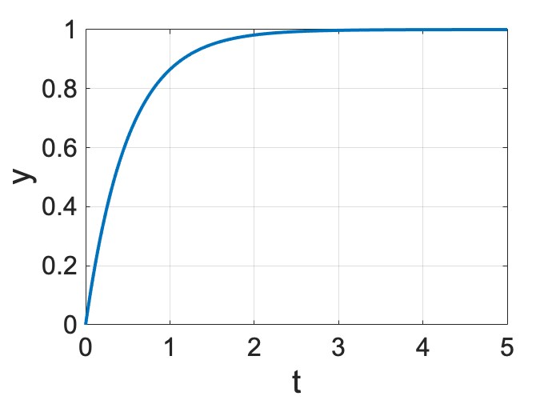


```matlab:Code
K = 1;
T = [1, 0.5, 0.1];
t = 0:0.01:5;
figure();
for i = 1:1:size(T,2)
    y = step( tf([0, K], [T(i), 1]), t);
    plot(t,y, 'linewidth', 2, 'DisplayName','T='+string(T(i)))
    hold on;
end

plot_set(gcf, 't', 'y', 'best')
```


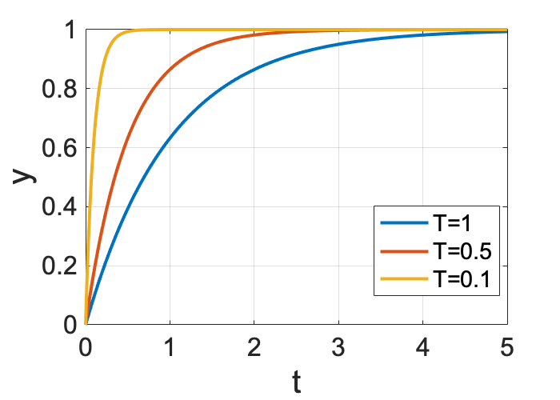


```matlab:Code
T = -1;
K = 1;
P = tf([0, K], [T, 1]);

figure();
t = 0:0.01:5;
y = step(P, t);
plot(t, y, 'linewidth', 2)

plot_set(gcf, 't', 'y')
```


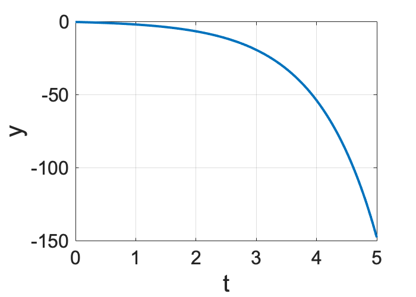


```matlab:Code
T = 0.5;
K = [1, 2, 3];
t = 0:0.01:5;
figure();
for i = 1:1:size(K,2)
    y = step( tf([0, K(i)], [T, 1]), t);
    plot(t,y, 'linewidth', 2, 'DisplayName','K='+string(K(i)))
    hold on;
end

plot_set(gcf, 't', 'y', 'best')
```


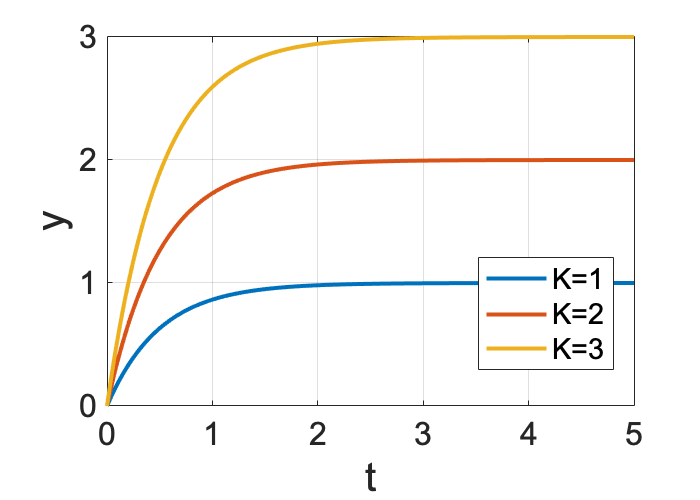

## ２次遅れ系

```matlab:Code
zeta = 0.4;
omega_n = 5;
t = 0:0.01:5;
figure();

P = tf([0,omega_n^2], [1, 2*zeta*omega_n, omega_n^2]);
y = step(P, t);
plot(t, y, 'color','k', 'Linewidth', 2);

ymax = 1 + 1 * exp(-(pi*zeta)/sqrt(1-zeta^2))
```


```text:Output
ymax = 1.2538
```


```matlab:Code
Tp = pi/omega_n/sqrt(1-zeta^2)
```


```text:Output
Tp = 0.6856
```


```matlab:Code

plot_set(gcf, 't', 'y')
```


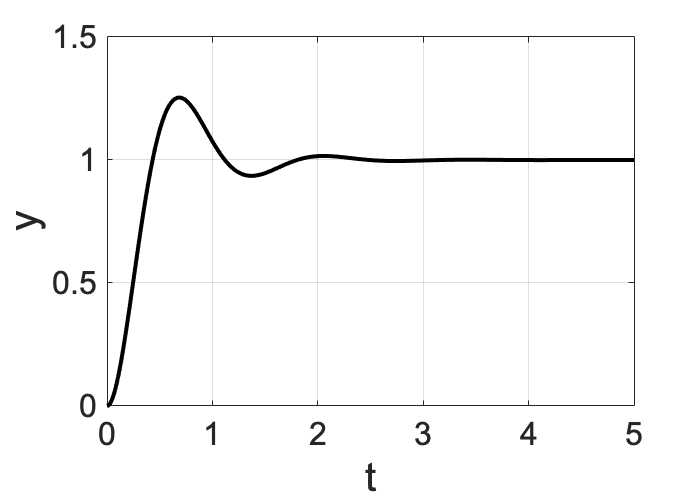


```matlab:Code
zeta = [1, 0.7, 0.4];
omega_n = 5;
figure();
for i = 1:1:size(zeta,2)
    P = tf([0,omega_n^2], [1, 2*zeta(i)*omega_n, omega_n^2]);
    y = step(P, t);
    plot(t,y, 'linewidth', 2, 'DisplayName','\zeta='+string(zeta(i)))
    hold on;
end

plot_set(gcf, 't', 'y', 'best') 
```


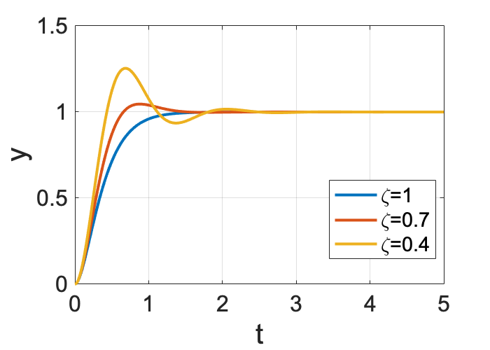


```matlab:Code
zeta = [0.1, 0, -0.05];
omega_n = 5;
figure();
for i = 1:1:size(zeta,2)
    P = tf([0,omega_n^2], [1, 2*zeta(i)*omega_n, omega_n^2]);
    y = step(P, t);
    plot(t,y, 'linewidth', 2, 'DisplayName','\zeta='+string(zeta(i)))
    hold on;
end

plot_set(gcf, 't', 'y', 'best') 
```


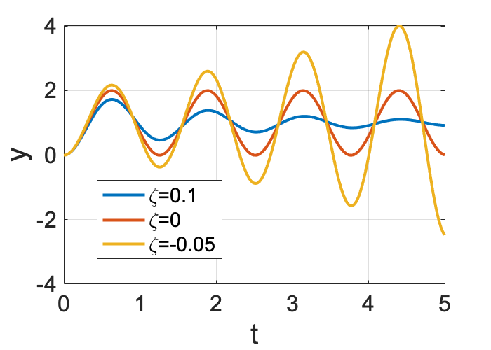


```matlab:Code
zeta = 0.7;
omega_n = [1, 5, 10];
figure();
for i = 1:1:size(omega_n,2)
    P = tf([0,omega_n(i)^2], [1, 2*zeta*omega_n(i), omega_n(i)^2]);
    y = step(P, t);
    plot(t,y, 'linewidth', 2, 'DisplayName','\omega_n='+string(omega_n(i)))
    hold on;
end

plot_set(gcf, 't', 'y', 'best') 
```


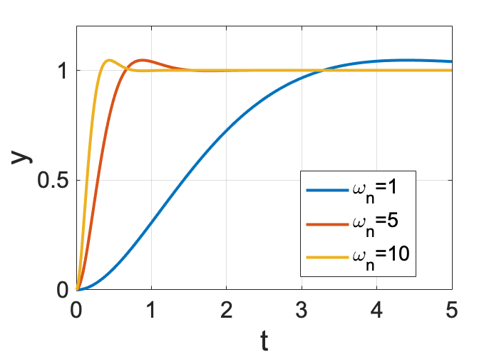

## ステップ応答の計算（数式処理）

```matlab:Code
syms s;
syms T;
P = 1/((1+T*s)*s);
partfrac(P, s)
```

ans = 

   

```matlab:Code
syms t;
ilaplace(1/s - 1/(s+1/T), s, t)
```

ans = 

   

```matlab:Code
syms w;
P = w^2/(s*(s+w)^2);
partfrac(P, s)
```

ans = 

   

```matlab:Code
P = partfrac(w^2/(s*(s+w)^2), s);
Pt = ilaplace(P, s, t)
```

Pt = 

   

```matlab:Code
syms p1;
syms p2;
P = w^2/(s*(s-p1)*(s-p2));
partfrac(P, s)
```

ans = 

   

```matlab:Code
ilaplace(P, s, t)
```

ans = 

   
## 練習問題

```matlab:Code
P1 = tf([1, 3], [1, 3, 2])
```


```text:Output
P1 =
 
      s + 3
  -------------
  s^2 + 3 s + 2
 
連続時間の伝達関数です。
```


```matlab:Code

t = 0:0.01:10;
figure();
y = step(P1, t);
plot(t, y, 'Linewidth', 2);
plot_set(gcf, 't', 'y')
```


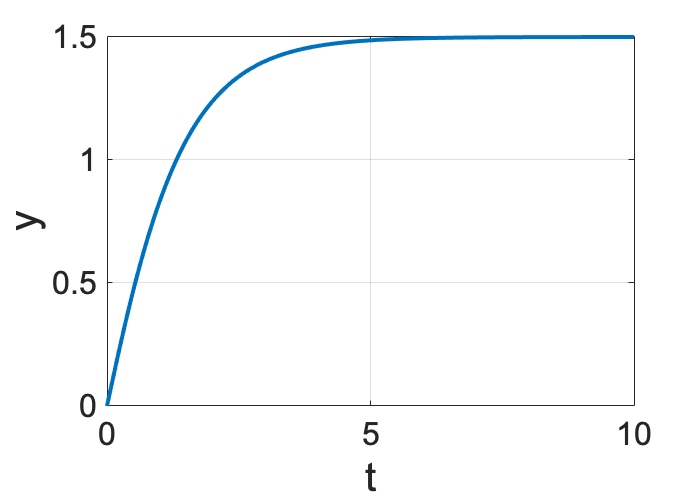


```matlab:Code
P2 = tf([0, 1], [1, 2, 2, 1])
```


```text:Output
P2 =
 
            1
  ---------------------
  s^3 + 2 s^2 + 2 s + 1
 
連続時間の伝達関数です。
```


```matlab:Code

t = 0:0.01:10;
figure();
y = step(P2, t);
plot(t, y, 'Linewidth', 2);
plot_set(gcf, 't', 'y')
```


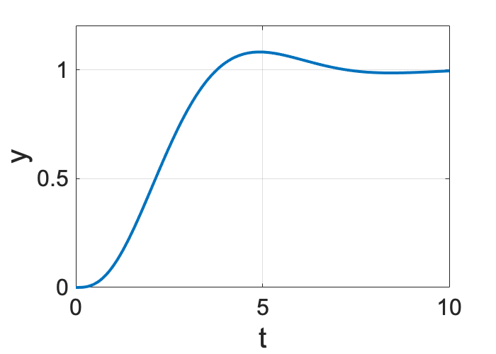

# 状態空間モデルの時間応答

```matlab:Code
A = [0, 1; -4, -5];
B = [0; 1];
C = eye(2);
D = zeros(2, 1);
P = ss(A, B, C, D);
eig(A)
```


```text:Output
ans = 2x1    
    -1
    -4

```

## 零入力応答

```matlab:Code
t = 0:0.01:5;
X0 = [-0.3, 0.4];
x = initial(P, X0, t) ;

figure();
plot(t, x(:,1), 'linewidth', 2, 'DisplayName', 'x_1');
hold on;
plot(t, x(:,2), 'linewidth', 2, 'DisplayName','x_2');

plot_set(gcf, 't', 'x', 'best')
```


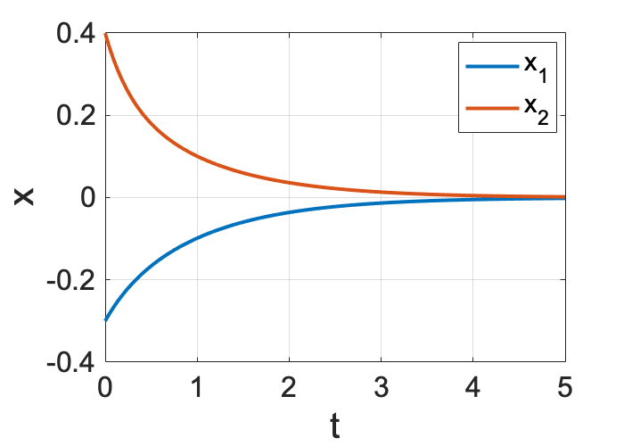

## 行列指数関数の計算（数式処理）

```matlab:Code
A = [ 0, 1; -4, -5];
syms s;
syms t;

G = s*eye(2)-A;
exp_At = ilaplace(inv(G), s, t)
```

exp_At = 

   
  

```matlab:Code
double(subs(exp_At, t, 5))
```


```text:Output
ans = 2x2    
    0.0090    0.0022
   -0.0090   -0.0022

```


```matlab:Code
A = [ 0, 1; -4, -5];
t = 5;
expm(A*t)
```


```text:Output
ans = 2x2    
    0.0090    0.0022
   -0.0090   -0.0022

```

## 零状態応答

```matlab:Code
t = 0:0.01:5;
x = step(P, t) ;

figure();
plot(t, x(:,1), 'linewidth', 2, 'DisplayName', 'x_1');
hold on;
plot(t, x(:,2), 'linewidth', 2, 'DisplayName','x_2');

plot_set(gcf, 't', 'x', 'best')
```


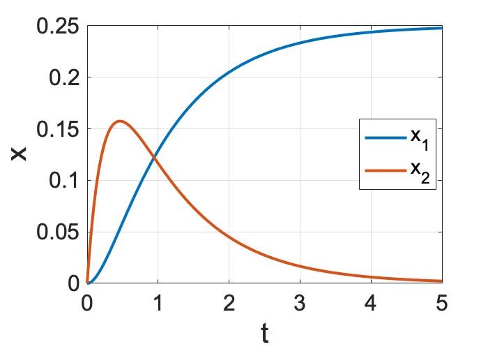

## 完全応答

```matlab:Code
t = 0:0.01:5;
Ud = 1*sign(t);

xst = step(P, t);
xin = initial(P, X0, t);
x = lsim(P, Ud, t, X0);

figure();
for i=1:2
    subplot(1,2,i)
    plot(t, x(:,i), 'b-','linewidth', 2, 'DisplayName', 'response');
    hold on;
    plot(t, xst(:,i), 'r--','linewidth', 2, 'DisplayName','zero state');
    plot(t, xin(:,i), 'k-.','linewidth', 2, 'DisplayName','zero input');
    plot_set(gcf, 't', 'x_'+string(i), 'best')
end
set(gcf,'Position',[100 100 700 300])
```


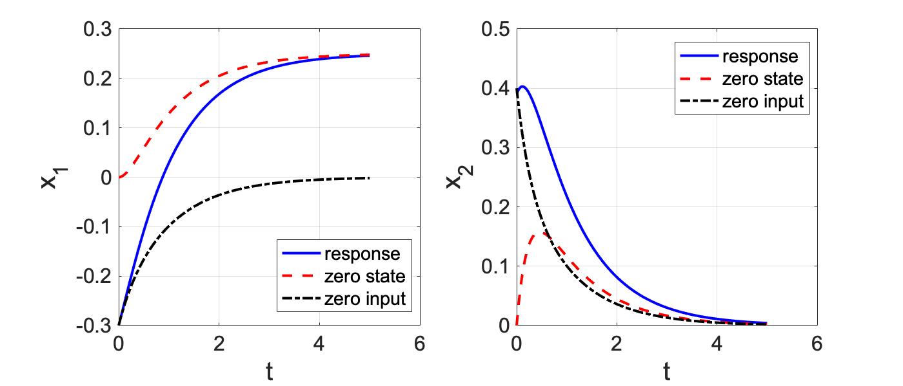

## 練習問題

```matlab:Code
t = 0:0.01:5;
Ud = 3*sin(5*t);
X0 = [0.5, 1]
```


```text:Output
X0 = 1x2    
    0.5000    1.0000

```


```matlab:Code

xst = lsim(P, Ud, t, 0*X0);
xin = initial(P, X0, t);
x = lsim(P, Ud, t, X0);

figure();
for i=1:2
    subplot(1,2,i)
    plot(t, x(:,i), 'b-','linewidth', 2, 'DisplayName', 'response');
    hold on;
    plot(t, xst(:,i), 'r--','linewidth', 2, 'DisplayName','zero state');
    plot(t, xin(:,i), 'k-.','linewidth', 2, 'DisplayName','zero input');
    plot_set(gcf, 't', 'x_'+string(i), 'best')
end
set(gcf,'Position',[100 100 700 300])
```


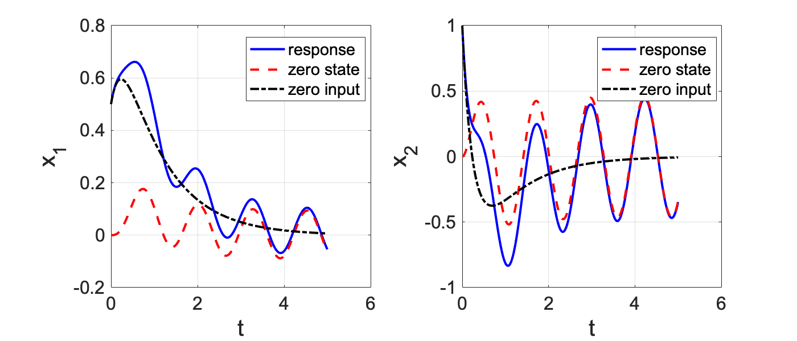

# 安定性
## 極

```matlab:Code
P1 = tf([0,1],[1, 1]);
disp('P1:');
```


```text:Output
P1:
```


```matlab:Code
pole(P1)
```


```text:Output
ans = -1
```


```matlab:Code

P2 = tf([0,1],[-1, 1]);
disp('P2:')
```


```text:Output
P2:
```


```matlab:Code
pole(P2)
```


```text:Output
ans = 1
```


```matlab:Code

P3 = tf([0,1],[1, 0.05, 1]);
disp('P3:');
```


```text:Output
P3:
```


```matlab:Code
pole(P3)
```


```text:Output
ans = 2x1 complex    
  -0.0250 + 0.9997i
  -0.0250 - 0.9997i

```


```matlab:Code

P4 = tf([0,1],[1, -0.05, 1]);
disp('P4:');
```


```text:Output
P4:
```


```matlab:Code
pole(P4)
```


```text:Output
ans = 2x1 complex    
   0.0250 + 0.9997i
   0.0250 - 0.9997i

```


```matlab:Code
figure();
P1pole = pole(P1);
P2pole = pole(P2);
P3pole = pole(P3);
P4pole = pole(P4);

scatter(real(P1pole), imag(P1pole), 'filled', 'DisplayName', 'P_1')
hold on;
scatter(real(P2pole), imag(P2pole), 'filled', 'DisplayName', 'P_2')
scatter(real(P3pole), imag(P3pole), 'filled', 'DisplayName', 'P_3')
scatter(real(P4pole), imag(P4pole), 'filled', 'DisplayName', 'P_4')
plot_set(gcf, 'Re', 'Im', 'best')
axis square;
```


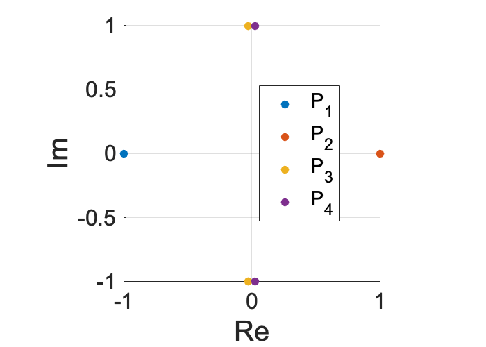


```matlab:Code
[Np, Dp] = tfdata(P4, 'v');
Dp
```


```text:Output
Dp = 1x3    
    1.0000   -0.0500    1.0000

```


```matlab:Code
roots(Dp)
```


```text:Output
ans = 2x1 complex    
   0.0250 + 0.9997i
   0.0250 - 0.9997i

```

  
## 位相面図

```matlab:Code
w = 1.5;
[X, Y] = meshgrid(-w:0.1:w,-w:0.1:w);
t = -w:0.1:w;

A = [0, 1; -4, -5];
[v, s] = eig(A);
disp('固有値=');
```


```text:Output
固有値=
```


```matlab:Code
s
```


```text:Output
s = 2x2    
    -1     0
     0    -4

```


```matlab:Code

U = A(1,1)*X + A(1,2)*Y;
V = A(2,1)*X + A(2,2)*Y;

figure();
quiver(X, Y, U, V)
hold on;
%固有空間のプロット
if (imag(s(1)) == 0 && imag(s(2)) == 0) %固有値が複素数の場合はプロットできない
    plot(t, (v(2,1)/v(1,1))*t)
    plot(t, (v(2,2)/v(1,2))*t)
end 
plot_set(gcf, 'x_1', 'x_2')
xlim(gca, [-1.5, 1.5]);
ylim(gca, [-1.5, 1.5]);
axis square;
```


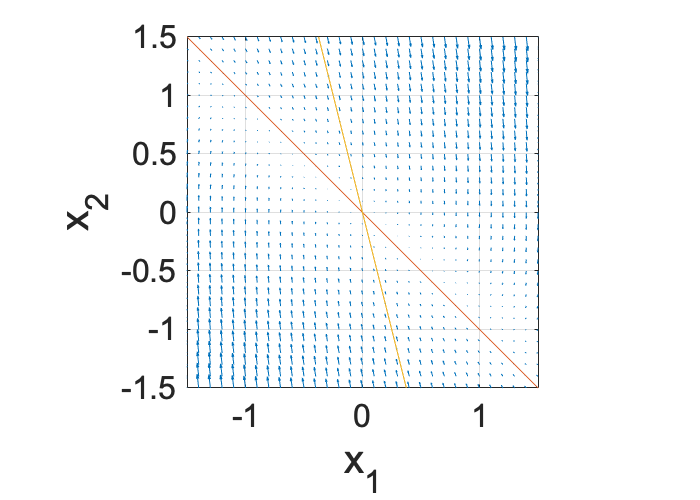


```matlab:Code
w = 1.5;
[X, Y] = meshgrid(-w:0.1:w,-w:0.1:w);
t = -w:0.1:w;

A = [0, 1; -4, 5];
[v, s] = eig(A);
disp('固有値=');
```


```text:Output
固有値=
```


```matlab:Code
s
```


```text:Output
s = 2x2    
     1     0
     0     4

```


```matlab:Code

U = A(1,1)*X + A(1,2)*Y;
V = A(2,1)*X + A(2,2)*Y;

figure();
quiver(X, Y, U, V)
hold on;
%固有空間のプロット
if (imag(s(1)) == 0 && imag(s(2)) == 0) %固有値が複素数の場合はプロットできない
    plot(t, (v(2,1)/v(1,1))*t)
    plot(t, (v(2,2)/v(1,2))*t)
end 
plot_set(gcf, 'x_1', 'x_2')
xlim(gca, [-1.5, 1.5]);
ylim(gca, [-1.5, 1.5]);
axis square;
```


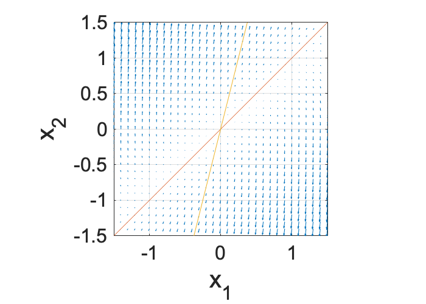


```matlab:Code
w = 1.5;
[X, Y] = meshgrid(-w:0.1:w,-w:0.1:w);
t = -w:0.1:w;

A = [0, 1; 4, 5];
[v, s] = eig(A);
disp('固有値=');
```


```text:Output
固有値=
```


```matlab:Code
s
```


```text:Output
s = 2x2    
   -0.7016         0
         0    5.7016

```


```matlab:Code

U = A(1,1)*X + A(1,2)*Y;
V = A(2,1)*X + A(2,2)*Y;

figure();
quiver(X, Y, U, V)
hold on;
%固有空間のプロット
if (imag(s(1)) == 0 && imag(s(2)) == 0) %固有値が複素数の場合はプロットできない
    plot(t, (v(2,1)/v(1,1))*t)
    plot(t, (v(2,2)/v(1,2))*t)
end 
plot_set(gcf, 'x_1', 'x_2')
xlim(gca, [-1.5, 1.5]);
ylim(gca, [-1.5, 1.5]);
axis square;
```


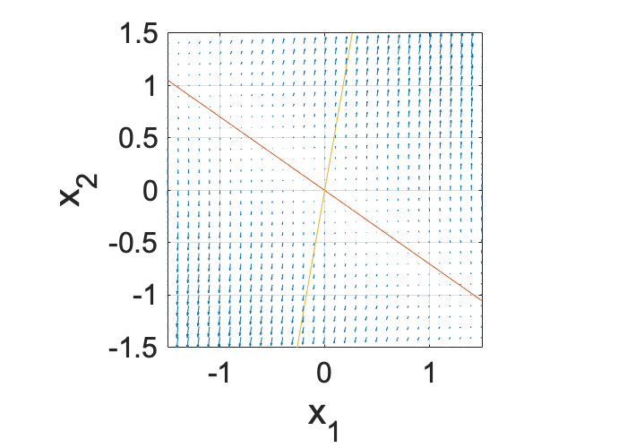

# 零点の影響

```matlab:Code
t = 0:0.01:5;
Ud = 1*sign(t);

zeta = .4;
omega_n = 3;

figure();

P = tf([ 0, omega_n^2],[1, 2*zeta*omega_n, omega_n^2]);
y = lsim(P, Ud, t, 0);
plot(t, y, 'linewidth', 2, 'DisplayName', 'P_1');
hold on;

P = tf([ 3, omega_n^2],[1, 2*zeta*omega_n, omega_n^2]);
y = lsim(P, Ud, t, 0);
plot(t, y, 'linewidth', 2, 'DisplayName', 'P_2');
hold on;

P = tf([ -3, omega_n^2],[1, 2*zeta*omega_n, omega_n^2]);
y = lsim(P, Ud, t, 0);
plot(t, y, 'linewidth', 2, 'DisplayName', 'P_3');
hold on;

plot_set(gcf, 't', 'y', 'best')
```


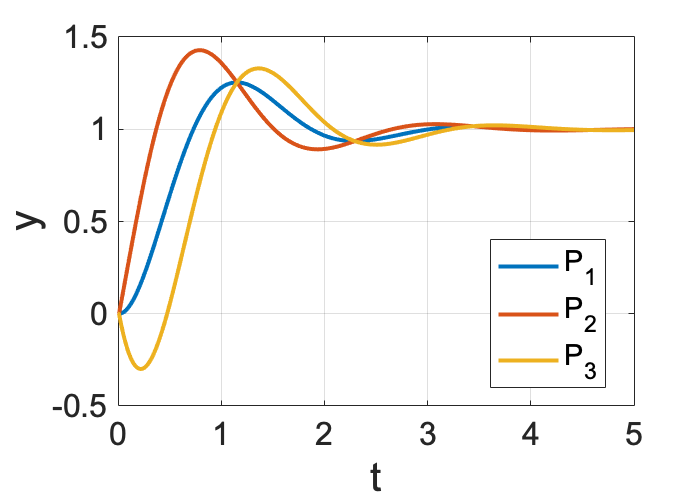

  
# 周波数応答


インパルスは余弦波の重ね合わせ


```matlab:Code
t = 0:0.01:3;

figure(); 

u = 0 * t;
for i=1:1:10
    u = u + (0.1/2/pi)*cos(t * i);
end
subplot(1,2,1);
plot(u, 'LineWidth', 2);
plot_set(gcf,'t','');

u = 0 * t;
for i=1:1:13000
    u = u + (0.1/2/pi)*cos(t * i);
end
subplot(1,2,2);
plot(u, 'LineWidth', 2);
plot_set(gcf,'t','');

set(gcf,'Position',[100 100 700 300])
```


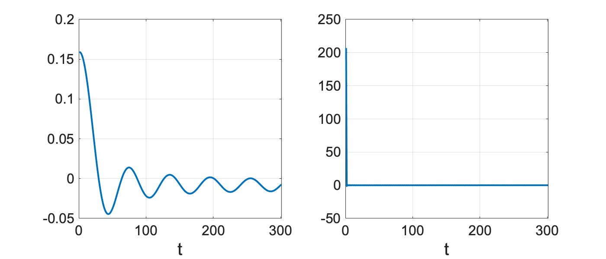

  

```matlab:Code
zeta = 0.7;
omega_n = 5;
P = tf([0,omega_n^2],[1, 2*zeta*omega_n, omega_n^2]);

figure();
freq = [2, 5, 10, 20];
t = 0:0.01:5;
for i=1:1:2
    for j=1:1:2
        u = sin(freq(2*(i-1)+j)*t);
        y = lsim(P, u, t, 0);
    
        subplot(2,2,2*(i-1)+j);
        plot(t, u, 'LineWidth', 2);
        hold on;
        plot(t, y, 'LineWidth', 2);
        plot_set(gcf, 't', 'u, y');
    end
end
set(gcf,'Position',[100 100 700 600])
```


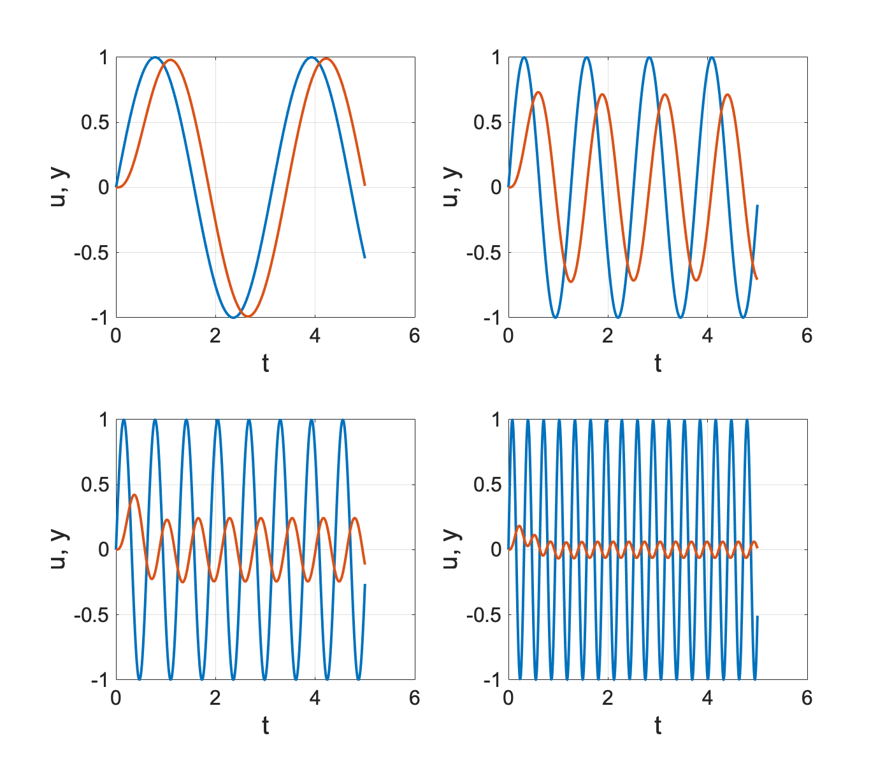

## **1次遅れ系のボード線図**

```matlab:Code
K = 1;
T = [1, 0.5, 0.1];

figure();
for i=1:1:size(T,2)
    P = tf([0, K],[T(i), 1]);
    [gain, phase, w] = bode(P, logspace(-2,2));
    
    gainLog = 20*log10(gain(:));
    phaseDeg = phase(:);
    
    subplot(2,1,1);
    semilogx(w, gainLog, 'LineWidth', 2, 'DisplayName', 'T='+string(T(i)));
    hold on;
    subplot(2,1,2);
    semilogx(w, phaseDeg, 'LineWidth', 2, 'DisplayName', 'T='+string(T(i)));
    hold on;

end
subplot(2,1,1); bodeplot_set(gcf, '\omega [rad/s]', 'Gain [dB]', 'best');
subplot(2,1,2); bodeplot_set(gcf, '\omega [rad/s]', 'Phase [deg]', 'best');
```


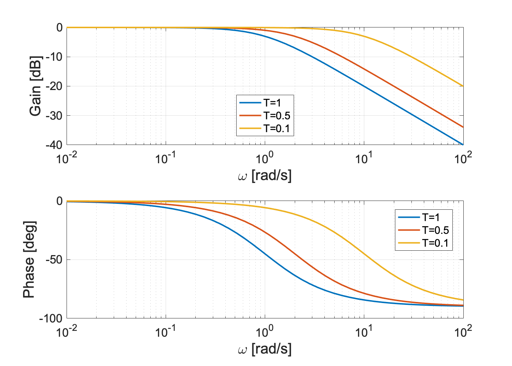

## **2次遅れ系のボード線図**

```matlab:Code
zeta = [1, 0.7, 0.4];
omega_n = 1;

figure();
for i=1:1:size(zeta,2)
    P = tf([0,omega_n^2], [1, 2*zeta(i)*omega_n, omega_n^2]);
    [gain, phase, w] = bode(P, logspace(-2,2));
    
    gainLog = 20*log10(gain(:));
    phaseDeg = phase(:);
    
    subplot(2,1,1);
    semilogx(w, gainLog, 'LineWidth', 2, 'DisplayName', '\zeta='+string(zeta(i)));
    hold on;
    subplot(2,1,2);
    semilogx(w, phaseDeg, 'LineWidth', 2, 'DisplayName', '\zeta='+string(zeta(i)));
    hold on;

end
subplot(2,1,1); bodeplot_set(gcf, '\omega [rad/s]', 'Gain [dB]', 'best');
subplot(2,1,2); bodeplot_set(gcf, '\omega [rad/s]', 'Phase [deg]', 'best');
```


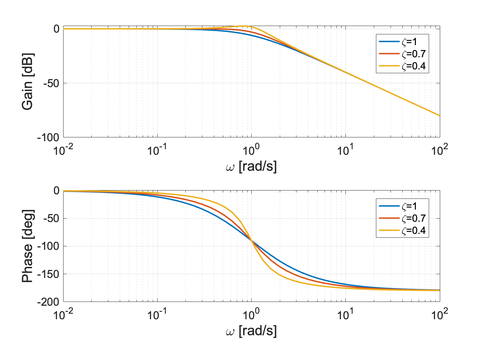


```matlab:Code
zeta = 0.7;
omega_n = [1, 5, 10];

figure();
for i=1:1:size(omega_n,2)
    P = tf([0,omega_n(i)^2], [1, 2*zeta*omega_n(i), omega_n(i)^2]);
    [gain, phase, w] = bode(P, logspace(-2,2));
    
    gainLog = 20*log10(gain(:));
    phaseDeg = phase(:);
    
    subplot(2,1,1);
    semilogx(w, gainLog, 'LineWidth', 2, 'DisplayName', '\omega_n='+string(omega_n(i)));
    hold on;
    subplot(2,1,2);
    semilogx(w, phaseDeg, 'LineWidth', 2, 'DisplayName', '\omega_n='+string(omega_n(i)));
    hold on;

end
subplot(2,1,1); bodeplot_set(gcf, '\omega [rad/s]', 'Gain [dB]', 'best');
subplot(2,1,2); bodeplot_set(gcf, '\omega [rad/s]', 'Phase [deg]', 'best');
```


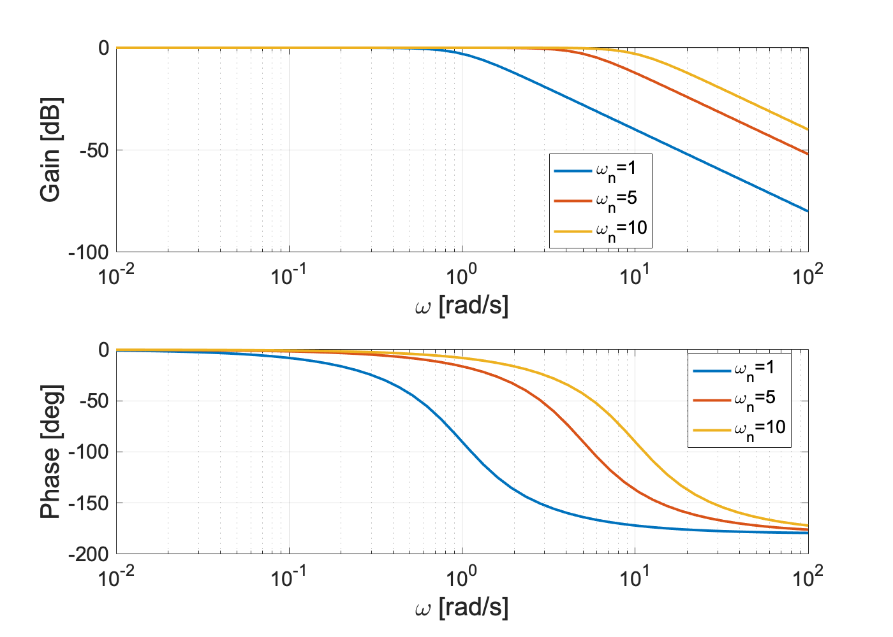

## 練習問題

```matlab:Code
P1 = tf([1, 3], [1, 3, 2])
```


```text:Output
P1 =
 
      s + 3
  -------------
  s^2 + 3 s + 2
 
連続時間の伝達関数です。
```


```matlab:Code
[gain, phase, w] = bode(P1, logspace(-2,2));
    
gainLog = 20*log10(gain(:));
phaseDeg = phase(:);

figure();
subplot(2,1,1);
semilogx(w, gainLog, 'LineWidth', 2, 'DisplayName', '\omega_n='+string(omega_n(i)));
bodeplot_set(gcf, '\omega [rad/s]', 'Gain [dB]');
subplot(2,1,2);
semilogx(w, phaseDeg, 'LineWidth', 2, 'DisplayName', '\omega_n='+string(omega_n(i)));
bodeplot_set(gcf, '\omega [rad/s]', 'Phase [deg]');
```


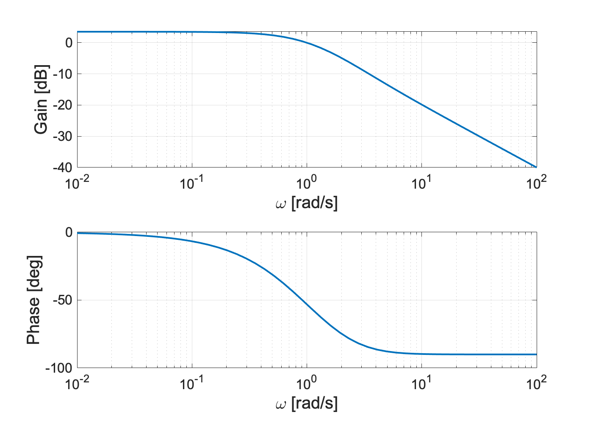


```matlab:Code
P2 = tf([0, 1], [1, 2, 2, 1])
```


```text:Output
P2 =
 
            1
  ---------------------
  s^3 + 2 s^2 + 2 s + 1
 
連続時間の伝達関数です。
```


```matlab:Code
[gain, phase, w] = bode(P1, logspace(-2,2));
    
gainLog = 20*log10(gain(:));
phaseDeg = phase(:);

figure();
subplot(2,1,1);
semilogx(w, gainLog, 'LineWidth', 2, 'DisplayName', '\omega_n='+string(omega_n(i)));
bodeplot_set(gcf, '\omega [rad/s]', 'Gain [dB]');
subplot(2,1,2);
semilogx(w, phaseDeg, 'LineWidth', 2, 'DisplayName', '\omega_n='+string(omega_n(i)));
bodeplot_set(gcf, '\omega [rad/s]', 'Phase [deg]');
```


# 安定判別

```matlab:Code
P = tf([0,1],[1, 2, 3, 4, 5])
```


```text:Output
P =
 
                1
  -----------------------------
  s^4 + 2 s^3 + 3 s^2 + 4 s + 5
 
連続時間の伝達関数です。
```


```matlab:Code
pole(P)
```


```text:Output
ans = 4x1 complex    
  -1.2878 + 0.8579i
  -1.2878 - 0.8579i
   0.2878 + 1.4161i
   0.2878 - 1.4161i

```


```matlab:Code
[~, Dp] = tfdata(P, 'v');
Dp
```


```text:Output
Dp = 1x5    
     1     2     3     4     5

```


```matlab:Code
roots(Dp)
```


```text:Output
ans = 4x1 complex    
  -1.2878 + 0.8579i
  -1.2878 - 0.8579i
   0.2878 + 1.4161i
   0.2878 - 1.4161i

```

