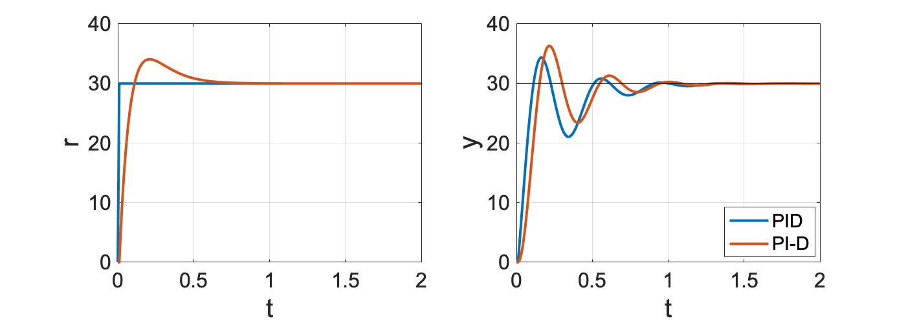
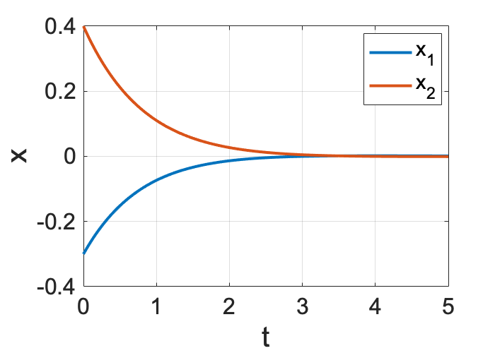

# Chapter5

```matlab:Code
clear
```

# 垂直駆動アームの角度追従制御

```matlab:Code
g  = 9.81;                % 重力加速度[m/s^2]
l  = 0.2;                 % アームの長さ[m]
M  = 0.5;                 % アームの質量[kg]
mu = 1.5e-2;              % 粘性摩擦係数[kg*m^2/s]
J  = 1.0e-2;              % 慣性モーメント[kg*m^2]

P = tf( [0,1], [J, mu, M*g*l] );

ref = 30; % 目標角度 [deg]
```

## **P制御**

```matlab:Code
kp = [0.5, 1, 2];

t = 0:0.01:2;
figure();
for i = 1:1:size(kp,2)
    K = tf([0, kp(i)], [0, 1]);
    Gyr = feedback(P*K, 1);
    y = step( Gyr, t);
    plot(t,y*ref, 'linewidth', 2, 'DisplayName','k_P='+string(kp(i)))
    hold on;
end
plot_set(gcf, 't', 'y', 'best')
plot(t, ref*ones(1,size(t,2)), 'k');
```


  

```matlab:Code
figure();
for i=1:1:size(kp,2)
    K = tf([0, kp(i)], [0, 1]);
    Gyr = feedback(P*K, 1);
    [gain, phase, w] = bode(Gyr, logspace(-1,2));
    
    gainLog = 20*log10(gain(:));
    phaseDeg = phase(:);
    
    subplot(2,1,1);
    semilogx(w, gainLog, 'LineWidth', 2, 'DisplayName','k_P='+string(kp(i)));
    hold on;
    subplot(2,1,2);
    semilogx(w, phaseDeg, 'LineWidth', 2, 'DisplayName','k_P='+string(kp(i)));
    hold on;

end
subplot(2,1,1); bodeplot_set(gcf, '\omega [rad/s]', 'Gain [dB]', 'best');
subplot(2,1,2); bodeplot_set(gcf, '\omega [rad/s]', 'Phase [deg]', 'best');
```


## **PD制御**

```matlab:Code
kp = 2;
kd = [0, 0.1, 0.2];

t = 0:0.01:2;
figure();
for i = 1:1:size(kd,2)
    K = tf([kd(i), kp], [0, 1]);
    Gyr = feedback(P*K, 1);
    y = step( Gyr, t);
    plot(t,y*ref, 'linewidth', 2, 'DisplayName','k_D='+string(kd(i)))
    hold on;
end
plot_set(gcf, 't', 'y', 'best')
plot(t, ref*ones(1,size(t,2)), 'k');
```


  

```matlab:Code
figure();
for i=1:1:size(kd,2)
    K = tf([kd(i), kp], [0, 1]);
    Gyr = feedback(P*K, 1);
    [gain, phase, w] = bode(Gyr, logspace(-1,2));
    
    gainLog = 20*log10(gain(:));
    phaseDeg = phase(:);
    
    subplot(2,1,1);
    semilogx(w, gainLog, 'LineWidth', 2, 'DisplayName','k_D='+string(kd(i)));
    hold on;
    subplot(2,1,2);
    semilogx(w, phaseDeg, 'LineWidth', 2, 'DisplayName','k_D='+string(kd(i)));
    hold on;

end
subplot(2,1,1); bodeplot_set(gcf, '\omega [rad/s]', 'Gain [dB]', 'best');
subplot(2,1,2); bodeplot_set(gcf, '\omega [rad/s]', 'Phase [deg]', 'best');
```


## **PID制御**

```matlab:Code
kp = 2;
kd = 0.1;
ki = [0, 5, 10];

t = 0:0.01:2;
figure();
for i = 1:1:size(ki,2)
    K = tf([kd, kp, ki(i)], [1, 0]);
    Gyr = feedback(P*K, 1);
    y = step( Gyr, t);
    plot(t,y*ref, 'linewidth', 2, 'DisplayName','k_I='+string(ki(i)))
    hold on;
end
plot_set(gcf, 't', 'y', 'best')
plot(t, ref*ones(1,size(t,2)), 'k');
```


  

```matlab:Code
figure();
for i=1:1:size(ki,2)
    K = tf([kd, kp, ki(i)], [1, 0]);
    Gyr = feedback(P*K, 1);
    [gain, phase, w] = bode(Gyr, logspace(-1,2));
    
    gainLog = 20*log10(gain(:));
    phaseDeg = phase(:);
    
    subplot(2,1,1);
    semilogx(w, gainLog, 'LineWidth', 2, 'DisplayName','k_I='+string(ki(i)));
    hold on;
    subplot(2,1,2);
    semilogx(w, phaseDeg, 'LineWidth', 2, 'DisplayName','k_I='+string(ki(i)));
    hold on;

end
subplot(2,1,1); bodeplot_set(gcf, '\omega [rad/s]', 'Gain [dB]', 'best');
subplot(2,1,2); bodeplot_set(gcf, '\omega [rad/s]', 'Phase [deg]', 'best');
```


## 練習問題（外乱抑制）

```matlab:Code
kp = 2;
kd = 0.1;
ki = [0, 5, 10];

t = 0:0.01:2;
figure();
for i = 1:1:size(ki,2)
    K = tf([kd, kp, ki(i)], [1, 0]);
    Gyd = feedback(P, K);
    y = step( Gyd, t);
    plot(t,y, 'linewidth', 2, 'DisplayName','k_I='+string(ki(i)))
    hold on;
end
plot_set(gcf, 't', 'y', 'best')
```


  

```matlab:Code
figure();
for i=1:1:size(ki,2)
    K = tf([kd, kp, ki(i)], [1, 0]);
    Gyd = feedback(P, K);
    [gain, phase, w] = bode(Gyd, logspace(-1,2));
    
    gainLog = 20*log10(gain(:));
    phaseDeg = phase(:);
    
    subplot(2,1,1);
    semilogx(w, gainLog, 'LineWidth', 2, 'DisplayName','k_I='+string(ki(i)));
    hold on;
    subplot(2,1,2);
    semilogx(w, phaseDeg, 'LineWidth', 2, 'DisplayName','k_I='+string(ki(i)));
    hold on;

end
subplot(2,1,1); bodeplot_set(gcf, '\omega [rad/s]', 'Gain [dB]', 'best');
subplot(2,1,2); bodeplot_set(gcf, '\omega [rad/s]', 'Phase [deg]', 'best');
```


# ２自由度制御

```matlab:Code
kp = 2;
ki = 10;
kd = 0.1;

K1 = tf([kd, kp, ki], [1, 0]);
K2 = tf([0, ki], [kd, kp, ki]);
K3 = tf([kp, ki], [kd, kp, ki]);
```

## **PI-D制御**

```matlab:Code
Gyz = feedback(P*K1, 1);
t = 0:0.01:2;
r = 1*sign(t);
z = lsim(K3, r, t, 0);

figure();

y = lsim( Gyz, r, t, 0);
subplot(1,2,1);
plot(t,r*ref, 'linewidth', 2);
hold on;

subplot(1,2,2);
plot(t,y*ref, 'linewidth', 2, 'DisplayName','PID');
hold on;

y = lsim( Gyz, z, t, 0);
subplot(1,2,1);
plot(t,z*ref, 'linewidth', 2);
plot_set(gcf, 't', 'r')

subplot(1,2,2);
plot(t,y*ref, 'linewidth', 2, 'DisplayName','PI-D');
plot_set(gcf, 't', 'y', 'best')
set(gcf,'Position',[100 100 700 250])
plot(t, ref*ones(1,size(t,2)), 'k');
```





制御入力


PID制御では，Gur がインプロパーになるので，擬似微分を用いて計算する


```matlab:Code
tau = 0.001; % ローパスフィルタ
Klp = tf([kd, 0], [tau, 1]); % 擬似微分器
Ktau = tf([kp, ki], [1, 0]) + Klp;

Gyz = feedback(P*Ktau, 1);
Guz = Ktau/(1+P*Ktau);

t = 0:0.01:2;
r = 1*sign(t);
z = lsim(K3, r, t, 0);

figure();

u = lsim( Guz, r, t, 0);
y = lsim( Gyz, r, t, 0);
subplot(1,2,1);
plot(t,u, 'linewidth', 2);
hold on;

subplot(1,2,2);
plot(t,y*ref, 'linewidth', 2, 'DisplayName','PID');
hold on;

u = lsim( Guz, z, t, 0);
y = lsim( Gyz, z, t, 0);
subplot(1,2,1);
plot(t,u, 'linewidth', 2);
plot_set(gcf, 't', 'u')

subplot(1,2,2);
plot(t,y*ref, 'linewidth', 2, 'DisplayName','PI-D');
plot_set(gcf, 't', 'y', 'best')
set(gcf,'Position',[100 100 700 250])
plot(t, ref*ones(1,size(t,2)), 'k');
```


## **I-PD制御**

```matlab:Code
Gyz = feedback(P*K1, 1);
t = 0:0.01:2;
r = 1*sign(t);
z = lsim(K2, r, t, 0);

figure();

y = lsim( Gyz, r, t, 0);
subplot(1,2,1);
plot(t,r*ref, 'linewidth', 2);
hold on;

subplot(1,2,2);
plot(t,y*ref, 'linewidth', 2, 'DisplayName','PID');
hold on;

y = lsim( Gyz, z, t, 0);
subplot(1,2,1);
plot(t,z*ref, 'linewidth', 2);
plot_set(gcf, 't', 'r')

subplot(1,2,2);
plot(t,y*ref, 'linewidth', 2, 'DisplayName','I-PD');
plot_set(gcf, 't', 'y', 'best')
set(gcf,'Position',[100 100 700 250])
```


制御入力


PID制御では，Gur がインプロパーになるので，擬似微分を用いて計算する


```matlab:Code
tau = 0.01; % ローパスフィルタ
Klp = tf([kd, 0], [tau, 1]); % 擬似微分器
Ktau = tf([kp, ki], [1, 0]) + Klp;

Gyz = feedback(P*Ktau, 1);
Guz = Ktau/(1+P*Ktau);

t = 0:0.01:2;
r = 1*sign(t);
z = lsim(K2, r, t, 0);

figure();

u = lsim( Guz, r, t, 0);
y = lsim( Gyz, r, t, 0);
subplot(1,2,1);
plot(t,u, 'linewidth', 2);
hold on;

subplot(1,2,2);
plot(t,y*ref, 'linewidth', 2, 'DisplayName','PID');
hold on;

u = lsim( Guz, z, t, 0);
y = lsim( Gyz, z, t, 0);
subplot(1,2,1);
plot(t,u, 'linewidth', 2);
plot_set(gcf, 't', 'u')

subplot(1,2,2);
plot(t,y*ref, 'linewidth', 2, 'DisplayName','I-PD');
plot_set(gcf, 't', 'y', 'best')
set(gcf,'Position',[100 100 700 250])
```


# 限界感度法
## 無駄時間システム

```matlab:Code
Pdelay  =  tf( [0,1], [J, mu, M*g*l], 'InputDelay', 0.005)
```


```text:Output
Pdelay =
 
                              1
  exp(-0.005*s) * --------------------------
                  0.01 s^2 + 0.015 s + 0.981
 
連続時間の伝達関数です。
```

## チューニング

```matlab:Code
kp0 = 2.9;

K = tf([0,  kp0], [0, 1]);
Gyr = feedback(Pdelay*K, 1);
t = 0:0.01:2;
figure();

y = step( Gyr, t);
figure();
plot(t,y*ref, 'linewidth', 2);
hold on;
plot_set(gcf, 't', 'y')
plot(t, ref*ones(1,size(t,2)), 'k');
```


  

```matlab:Code
kp = [0, 0];
ki = [0, 0];
kd = [0, 0];
Rule = ["Classic", "No Overshoot"];

T0 = 0.3;
% Classic ZN
kp(1) = 0.6 * kp0
```


```text:Output
kp = 1x2    
    1.7400         0

```


```matlab:Code
ki(1) = kp(1) / (0.5 * T0)
```


```text:Output
ki = 1x2    
   11.6000         0

```


```matlab:Code
kd(1) = kp(1) * (0.125 * T0)
```


```text:Output
kd = 1x2    
    0.0653         0

```


```matlab:Code
disp('------------');
```


```text:Output
------------
```


```matlab:Code
% No overshoot
kp(2) = 0.2 * kp0
```


```text:Output
kp = 1x2    
    1.7400    0.5800

```


```matlab:Code
ki(2) = kp(2) / (0.5 * T0)
```


```text:Output
ki = 1x2    
   11.6000    3.8667

```


```matlab:Code
kd(2) = kp(2) * (0.33 * T0)
```


```text:Output
kd = 1x2    
    0.0653    0.0574

```


```matlab:Code

t = 0:0.01:2;
figure();
for i = 1:1:2
    K = tf([kd(i), kp(i), ki(i)], [1, 0]);
    Gyr = feedback(P*K, 1);
    y = step( Gyr, t);
    plot(t,y*ref, 'linewidth', 2, 'DisplayName',Rule(i) )
    hold on;
end
plot_set(gcf, 't', 'y', 'best')
plot(t, ref*ones(1,size(t,2)), 'k');
```


# モデルマッチング

```matlab:Code
syms s;
syms kp kd ki;
syms Mgl mu J;

G = (kp*s+ki)/(J*s^3 +(mu+kd)*s^2 + (Mgl + kp)*s + ki);
taylor(1/G, s, 'ExpansionPoint', 0, 'Order', 4)
```

ans = 

   
  

```matlab:Code
syms z wn

f1 = Mgl/ki-2*z/wn;
f2 = (mu+kd)/ki-Mgl*kp/(ki^2)-1/(wn^2);
f3 = J/ki-kp*(mu+kd)/(ki^2)+Mgl*kp^2/(ki^3);
S = solve([f1==0, f2==0, f3==0],[kp, kd, ki]);
S.kp
```

ans = 

   

```matlab:Code
S.kd
```

ans = 

   

```matlab:Code
S.ki
```

ans = 

   

```matlab:Code
g  = 9.81;                % 重力加速度[m/s^2]
l  = 0.2;                 % アームの長さ[m]
M  = 0.5;                 % アームの質量[kg]
mu = 1.5e-2;              % 粘性摩擦係数[kg*m^2/s]
J  = 1.0e-2;              % 慣性モーメント[kg*m^2]

P = tf( [0,1], [J, mu, M*g*l] );

ref = 30; % 目標角度 [deg]
```

  

```matlab:Code
omega_n = 15;
zeta = [1, 1/sqrt(2)];
Label = ["Binomial coeff.", "Butterworth"];

t = 0:0.01:2;
figure();
for i = 1:1:2
    Msys = tf([0,omega_n^2], [1,2*zeta(i)*omega_n,omega_n^2]);
    y = step( Msys, t);
    plot(t,y*ref, 'linewidth', 2, 'DisplayName', Label(i) )
    hold on;
end
plot_set(gcf, 't', 'y', 'best')
plot(t, ref*ones(1,size(t,2)), 'k');
```


  

```matlab:Code
omega_n = 15;
zeta = 0.707;

Msys = tf([0,omega_n^2], [1,2*zeta*omega_n,omega_n^2]);

kp = omega_n^2*J
```


```text:Output
kp = 2.2500
```


```matlab:Code
ki = omega_n*M*g*l/(2*zeta)
```


```text:Output
ki = 10.4066
```


```matlab:Code
kd = 2*zeta*omega_n*J + M*g*l/(2*zeta*omega_n) - mu
```


```text:Output
kd = 0.2434
```


```matlab:Code

t = 0:0.01:2;
figure();

y = step( Msys, t);
plot(t,y*ref, 'linewidth', 2, 'DisplayName', 'M' )
hold on;

Gyr = tf([kp,ki], [J, mu+kd, M*g*l+kp, ki]);
y = step( Gyr, t);
plot(t,y*ref, 'linewidth', 2, 'DisplayName', 'Gyr' )
hold on;

plot_set(gcf, 't', 'y', 'best')
plot(t, ref*ones(1,size(t,2)), 'k');
```


```matlab:Code
alpha1 = [3, 2, 2.15];
alpha2 = [3, 2, 1,75];
omega_n = 15;
Label = ["Binomial coeff.", "Butterworth", "ITAE"];

t = 0:0.01:2;
figure();
for i = 1:1:3
    M = tf([0, omega_n^3], [1, alpha2(i)*omega_n, alpha1(i)*omega_n^2, omega_n^3]);
    y = step( M, t);
    plot(t,y*ref, 'linewidth', 2, 'DisplayName', Label(i) )
    hold on;
end
plot_set(gcf, 't', 'y', 'best')
plot(t, ref*ones(1,size(t,2)), 'k');
```


# 状態フィードバック
## 極配置

```matlab:Code
A = [0 1; -4 5];
B = [0; 1];
C = [1 0 ; 0 1];
D = [0; 0];
P = ss(A, B, C, D)
```


```text:Output
P =
 
  A = 
       x1  x2
   x1   0   1
   x2  -4   5
 
  B = 
       u1
   x1   0
   x2   1
 
  C = 
       x1  x2
   y1   1   0
   y2   0   1
 
  D = 
       u1
   y1   0
   y2   0
 
連続時間状態空間モデル。
```


```matlab:Code
eig(P.A)
```


```text:Output
ans = 2x1    
     1
     4

```


```matlab:Code
Pole = [-1, -1];
F = -acker(P.A, P.B, Pole)
```


```text:Output
F = 1x2    
     3    -7

```


```matlab:Code
eig(P.A + P.B*F)
```


```text:Output
ans = 2x1    
    -1
    -1

```


```matlab:Code
t = 0:0.01:5;
X0 = [-0.3, 0.4];

Acl = P.A + P.B*F;
Pfb = ss(Acl, P.B, P.C, P.D);
x = initial(Pfb, X0, t) ;

figure();
plot(t, x(:,1), 'linewidth', 2, 'DisplayName','x_1');
hold on;
plot(t, x(:,2), 'linewidth', 2, 'DisplayName','x_2');

plot_set(gcf, 't', 'x', 'best')
```




## 最適レギュレータ

```matlab:Code
Q = [ 100, 0; 0, 1 ];
R = 1;

[F, X, E] = lqr(P.A, P.B, Q, R);
F = -F
```


```text:Output
F = 1x2    
   -6.7703  -11.2881

```


```matlab:Code

disp('--- フィードバックゲイン ---')
```


```text:Output
--- フィードバックゲイン ---
```


```matlab:Code
F
```


```text:Output
F = 1x2    
   -6.7703  -11.2881

```


```matlab:Code
-(1/R)*P.B'*X
```


```text:Output
ans = 1x2    
   -6.7703  -11.2881

```


```matlab:Code
disp('--- 閉ループ極 ---')
```


```text:Output
--- 閉ループ極 ---
```


```matlab:Code
E
```


```text:Output
E = 2x1 complex    
  -3.1441 + 0.9408i
  -3.1441 - 0.9408i

```


```matlab:Code
eig(P.A+P.B*F)
```


```text:Output
ans = 2x1 complex    
  -3.1441 + 0.9408i
  -3.1441 - 0.9408i

```

  

```matlab:Code
[X, E, F] = care(P.A, P.B, Q, R);
F = -F
```


```text:Output
F = 1x2    
   -6.7703  -11.2881

```


```matlab:Code
disp('--- フィードバックゲイン ---')
```


```text:Output
--- フィードバックゲイン ---
```


```matlab:Code
F
```


```text:Output
F = 1x2    
   -6.7703  -11.2881

```


```matlab:Code
disp('--- 閉ループ極 ---')
```


```text:Output
--- 閉ループ極 ---
```


```matlab:Code
E
```


```text:Output
E = 2x1 complex    
  -3.1441 + 0.9408i
  -3.1441 - 0.9408i

```

  

```matlab:Code
t = 0:0.01:5;
X0 = [-0.3, 0.4];

Acl = P.A + P.B*F;
Pfb = ss(Acl, P.B, P.C, P.D);
x = initial(Pfb, X0, t) ;

figure();
plot(t, x(:,1), 'linewidth', 2, 'DisplayName','x_1');
hold on;
plot(t, x(:,2), 'linewidth', 2, 'DisplayName','x_2');

plot_set(gcf, 't', 'x', 'best')
```


## **円条件（最適レギュレータのロバスト性）**

```matlab:Code
A = [0 1; -4 5];
B = [0; 1];
C = [1 0 ; 0 1];
D = [0; 0];
P = ss(A, B, C, D);
L = ss(P.A, P.B, -F, 0)
```


```text:Output
L =
 
  A = 
       x1  x2
   x1   0   1
   x2  -4   5
 
  B = 
       u1
   x1   0
   x2   1
 
  C = 
          x1     x2
   y1   6.77  11.29
 
  D = 
       u1
   y1   0
 
連続時間状態空間モデル。
```

  

```matlab:Code
figure();
[x, y] = nyquist(L, logspace(-2,3,1000));
plot(x(:), y(:), 'LineWidth', 2);
hold on;
plot(x(:), -y(:), '--', 'LineWidth', 2);
scatter(-1, 0, 'filled', 'k');

plot_set(gcf, '', '')
xlim(gca, [-3, 3])
ylim(gca, [-3, 3])
axis square
```


開ループ系のナイキスト軌跡が (-1, 0j) を中心とする単位円の中に入らない．


これにより，位相余裕が 60 [deg] 以上であることが保証される．


## ハミルトン行列

```matlab:Code
H = [ P.A  -P.B*(1/R)*P.B'; -Q -P.A'];
eigH = eig(H);

eigH_stable= [];
for i=1:1:size(eigH,1)
    if real(eigH(i)) < 0 
       eigH_stable = [eigH_stable, eigH(i)];
    end
end
eigH_stable
```


```text:Output
eigH_stable = 1x2 complex    
  -3.1441 + 0.9408i  -3.1441 - 0.9408i

```


```matlab:Code

F = -acker(P.A, P.B, eigH_stable)
```


```text:Output
F = 1x2    
   -6.7703  -11.2881

```

# 積分サーボ系

```matlab:Code
A = [0 1; -4 5];
B = [0; 1];
C = [1 0 ; 0 1];
D = [0; 0];
P = ss(A, B, C, D);
```

  

```matlab:Code
Pole = [-1, -1];
F = -acker(P.A, P.B, Pole)
```


```text:Output
F = 1x2    
     3    -7

```


```matlab:Code
t = 0:0.01:8;
X0 = [-0.3, 0.4];
Ud = 0.2*sign(t);

Acl = P.A + P.B*F;
Pfb = ss(Acl, P.B, P.C, P.D);
x = lsim(Pfb, Ud, t, X0);

figure();
plot(t, x(:,1), 'linewidth', 2, 'DisplayName','x_1');
hold on;
plot(t, x(:,2), 'linewidth', 2, 'DisplayName','x_2');

plot_set(gcf, 't', 'x', 'best')
```


  

```matlab:Code
A = [0 1; -4 5];
B = [0; 1];
C = [1 0];
D = 0;
P = ss(A, B, C, D);

Abar = [P.A zeros(2,1); -P.C 0];
Bbar = [ P.B ; 0];
Cbar = [ P.C 0 ];
```

  

```matlab:Code
Pole = [-1, -1, -5];
Fbar = -acker(Abar, Bbar, Pole)
```


```text:Output
Warning: Pole locations are more than 10% in error.
Fbar = 1x3    
    -7   -12     5

```


```matlab:Code
t = 0:0.01:8;
X0 = [-0.3, 0.4];
Ud = 0.2*sign(t);

Acl = Abar + Bbar*Fbar;
Pfb = ss(Acl, Bbar, eye(3), zeros(3,1));
x = lsim(Pfb, Ud, t, [X0, 0]);

figure();
plot(t, x(:,1), 'linewidth', 2, 'DisplayName','x_1');
hold on;
plot(t, x(:,2), 'linewidth', 2, 'DisplayName','x_2');

plot_set(gcf, 't', 'x', 'best')
```


## 可制御性，可観測性

```matlab:Code
A = [0 1; -4 5];
B = [0; 1];
C = [1 0];
D = 0;
P = ss(A, B, C, D);
```

  

```matlab:Code
Uc = ctrb(P.A, P.B)
```


```text:Output
Uc = 2x2    
     0     1
     1     5

```


```matlab:Code
det(Uc)
```


```text:Output
ans = -1
```


```matlab:Code
rank(Uc)
```


```text:Output
ans = 2
```

  

```matlab:Code
Uo = obsv(P.A, P.C)
```


```text:Output
Uo = 2x2    
     1     0
     0     1

```


```matlab:Code
det(Uo)
```


```text:Output
ans = 1
```


```matlab:Code
rank(Uo)
```


```text:Output
ans = 2
```

  
  
