# Chapter6

```matlab:Code
clear
```

# ナイキストの安定判別
  

```matlab:Code
P = tf([0, 1], [1, 1, 1.5, 1])
```


```text:Output
P =
 
            1
  ---------------------
  s^3 + s^2 + 1.5 s + 1
 
連続時間の伝達関数です。
```


```matlab:Code
pole(P)
```


```text:Output
ans = 3x1 complex    
  -0.1204 + 1.1414i
  -0.1204 - 1.1414i
  -0.7592 + 0.0000i

```

  

```matlab:Code
[Gm, Pm, wpc, wgc] = margin(P);
```


```text:Output
警告: 閉ループ システムは不安定です。
```


```matlab:Code

figure();
t = 0:0.1:30;
u = sin(wpc*t');
y = 0 * u;

for i=1:1:2
    for j=1:1:2
        u = sin(wpc*t') - y;
        y = lsim(P, u, t, 0);
    
        subplot(2,2,2*(i-1)+j);
        plot(t, u, 'LineWidth', 2);
        hold on;
        plot(t, y, 'LineWidth', 2);
        plot_set(gcf, 't', 'u, y');
    end
end
set(gcf,'Position',[100 100 700 600])
```


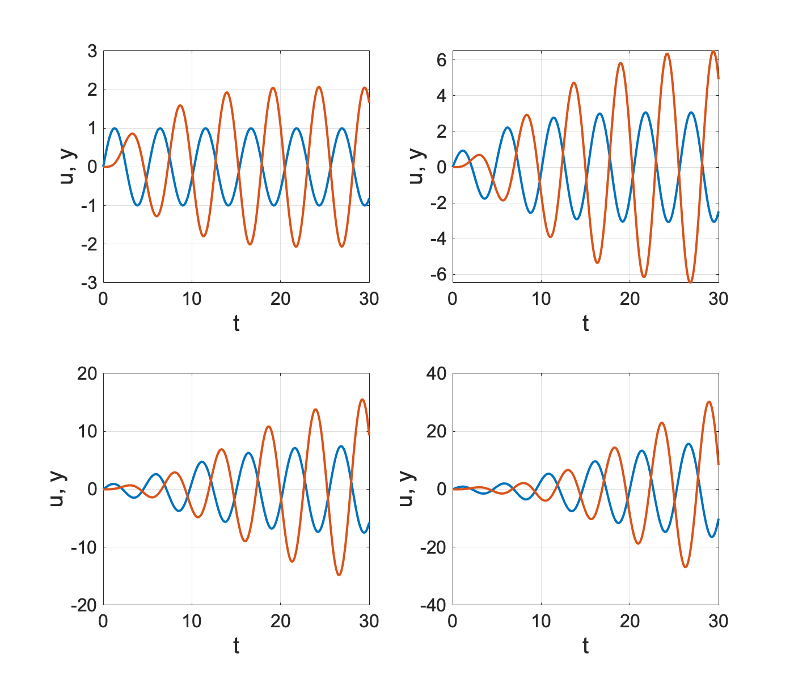

  

```matlab:Code
figure();
[x, y] = nyquist(P, logspace(-3,5,1000));
plot(x(:), y(:), 'LineWidth', 2);
hold on;
plot(x(:), -y(:), '--', 'LineWidth', 2);
scatter(-1, 0, 'filled', 'k');

plot_set(gcf, '', '')
xlim(gca, [-3, 3])
ylim(gca, [-3, 3])
axis square
```


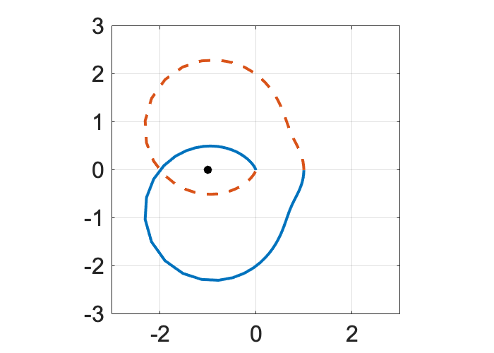

  

```matlab:Code
P = tf([0, 1], [1, 2, 2, 1])
```


```text:Output
P =
 
            1
  ---------------------
  s^3 + 2 s^2 + 2 s + 1
 
連続時間の伝達関数です。
```


```matlab:Code
pole(P)
```


```text:Output
ans = 3x1 complex    
  -1.0000 + 0.0000i
  -0.5000 + 0.8660i
  -0.5000 - 0.8660i

```

  

```matlab:Code
[Gm, Pm, wpc, wgc] = margin(P);

figure();
t = 0:0.1:30;
u = sin(wpc*t');
y = 0 * u;

for i=1:1:2
    for j=1:1:2
        u = sin(wpc*t') - y;
        y = lsim(P, u, t, 0);
    
        subplot(2,2,2*(i-1)+j);
        plot(t, u, 'LineWidth', 2);
        hold on;
        plot(t, y, 'LineWidth', 2);
        plot_set(gcf, 't', 'u, y');
    end
end
set(gcf,'Position',[100 100 700 600])
```


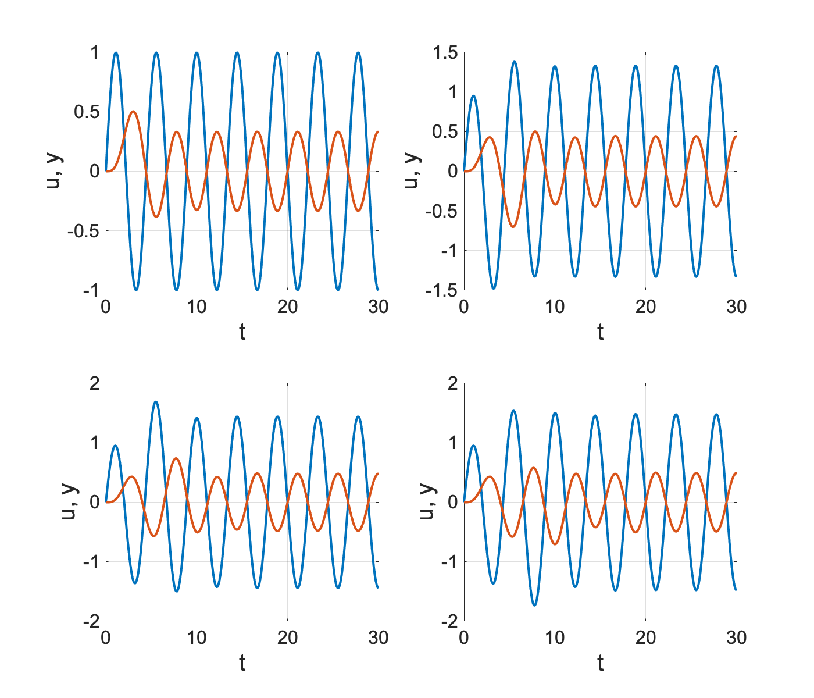

  

```matlab:Code
figure();
[x, y] = nyquist(P, logspace(-3,5,1000));
plot(x(:), y(:), 'LineWidth', 2);
hold on;
plot(x(:), -y(:), '--', 'LineWidth', 2);
scatter(-1, 0, 'filled', 'k');

plot_set(gcf, '', '')
xlim(gca, [-1.5, 1.5])
ylim(gca, [-1.5, 1.5])
axis square
```


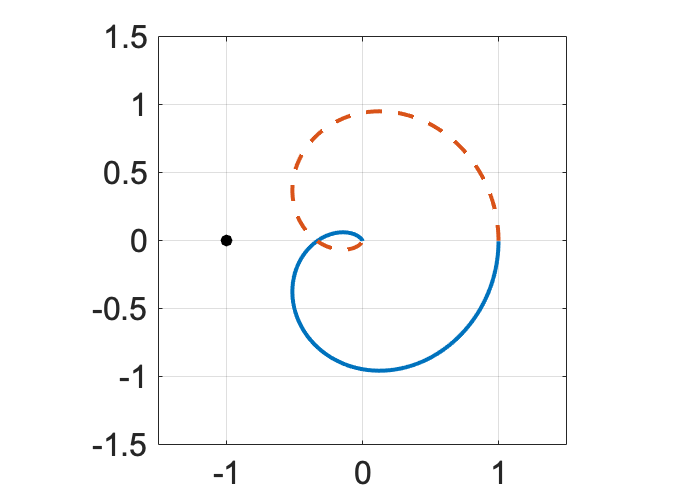

# アームの角度制御（PID制御）

```matlab:Code
g  = 9.81;                % 重力加速度[m/s^2]
l  = 0.2;                 % アームの長さ[m]
M  = 0.5;                 % アームの質量[kg]
mu = 1.5e-2;              % 粘性摩擦係数[kg*m^2/s]
J  = 1.0e-2;              % 慣性モーメント[kg*m^2]

P = tf( [0,1], [J, mu, M*g*l] );

ref = 30; % 目標角度 [deg]
```

## P制御

```matlab:Code
kp = [0.5, 1, 2];

figure();
for i=1:1:size(kp,2)
    K = tf([0, kp(i)], [0, 1]);
    H = P * K;
    [gain, phase, w] = bode(H, logspace(-1,2));
    
    gainLog = 20*log10(gain(:));
    phaseDeg = phase(:);
    
    subplot(2,1,1);
    semilogx(w, gainLog, 'LineWidth', 2, 'DisplayName','k_P='+string(kp(i)));
    hold on;
    subplot(2,1,2);
    semilogx(w, phaseDeg, 'LineWidth', 2, 'DisplayName','k_P='+string(kp(i)));
    hold on;
    
    disp('kp='+string(kp(i))); 
    [gm, pm, wpc, wgc] = margin(H)
    disp('----------------');
end
```


```text:Output
kp=0.5
gm = Inf
pm = 21.1561
wpc = Inf
wgc = 12.0304
----------------
kp=1
gm = Inf
pm = 12.1170
wpc = Inf
wgc = 13.9959
----------------
kp=2
gm = Inf
pm = 7.4192
wpc = Inf
wgc = 17.2170
----------------
```


```matlab:Code
subplot(2,1,1); bodeplot_set(gcf, '\omega [rad/s]', 'Gain [dB]', 'best');
subplot(2,1,2); bodeplot_set(gcf, '\omega [rad/s]', 'Phase [deg]', 'best');
```


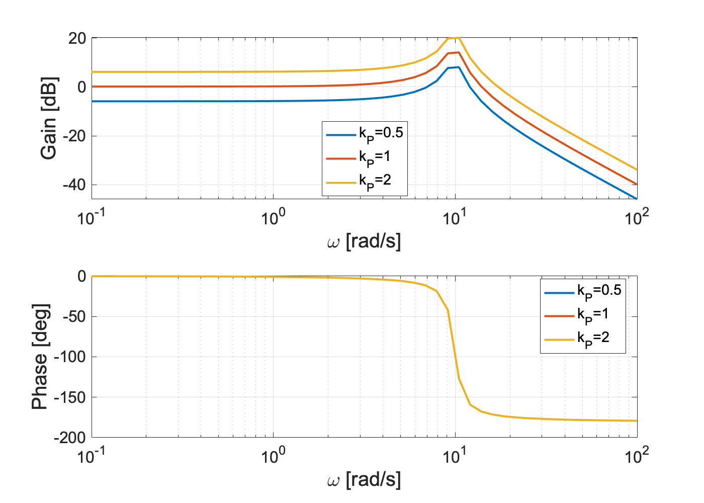

## PI制御

```matlab:Code
kp = 2;
ki = [0, 5, 10];

figure();
for i=1:1:size(ki,2)
    K = tf([kp, ki(i)], [1, 0]);
    H = P * K;
    [gain, phase, w] = bode(H, logspace(-1,2));
    
    gainLog = 20*log10(gain(:));
    phaseDeg = phase(:);
    
    subplot(2,1,1);
    semilogx(w, gainLog, 'LineWidth', 2, 'DisplayName','k_I='+string(ki(i)));
    hold on;
    subplot(2,1,2);
    semilogx(w, phaseDeg, 'LineWidth', 2, 'DisplayName','k_I='+string(ki(i)));
    hold on;
    
    disp('ki='+string(ki(i))); 
    [gm, pm, wpc, wgc] = margin(H)
    disp('----------------');

end
```


```text:Output
ki=0
警告: 閉ループ システムは不安定です。
gm = Inf
pm = 7.4192
wpc = Inf
wgc = 17.2170
----------------
ki=5
警告: 閉ループ システムは不安定です。
gm = 0.7397
pm = -0.8651
wpc = 15.6862
wgc = 17.2776
----------------
ki=10
警告: 閉ループ システムは不安定です。
gm = 0.2109
pm = -8.7614
wpc = 11.8443
wgc = 17.4498
----------------
```


```matlab:Code
subplot(2,1,1); bodeplot_set(gcf, '\omega [rad/s]', 'Gain [dB]', 'best');
```


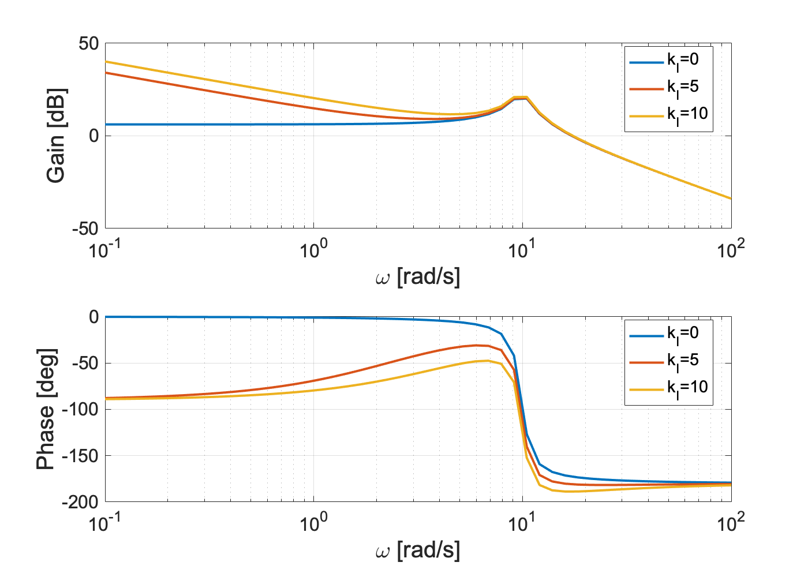


```matlab:Code
subplot(2,1,2); bodeplot_set(gcf, '\omega [rad/s]', 'Phase [deg]', 'best');
```

  

```matlab:Code
t = 0:0.01:2;
figure();
for i=1:1:size(ki,2)
    K = tf([kp, ki(i)], [1, 0]);
    Gyr = feedback(P*K, 1);
    y = step( Gyr, t);
    plot(t,y*ref, 'linewidth', 2, 'DisplayName','k_I='+string(ki(i)))
    hold on;
end
plot_set(gcf, 't', 'y', 'best')
plot(t, ref*ones(1,size(t,2)), 'k');
```


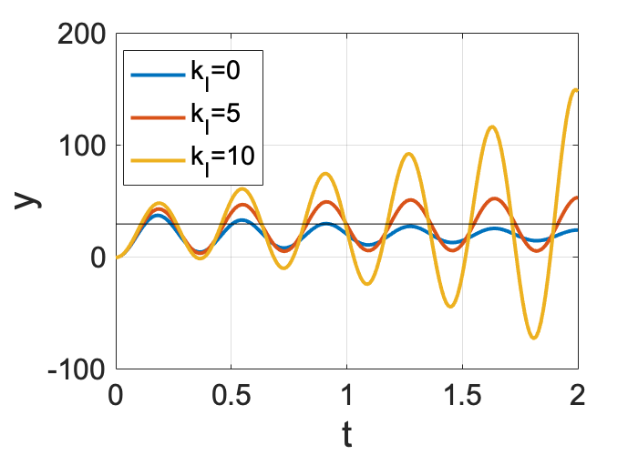

## PID制御

```matlab:Code
kp = 2;
ki = 5;
kd = [0, 0.1, 0.2];

figure();
for i=1:1:size(kd,2)
    K = tf([kd(i), kp, ki], [1,0]);
    H = P * K;
    [gain, phase, w] = bode(H, logspace(-1,2));
    
    gainLog = 20*log10(gain(:));
    phaseDeg = phase(:);
    
    subplot(2,1,1);
    semilogx(w, gainLog, 'LineWidth', 2, 'DisplayName','k_D='+string(kd(i)));
    hold on;
    subplot(2,1,2);
    semilogx(w, phaseDeg, 'LineWidth', 2, 'DisplayName','k_D='+string(kd(i)));
    hold on;
    
    disp('kd='+string(kd(i))); 
    [gm, pm, wpc, wgc] = margin(H)
    disp('----------------');

end
```


```text:Output
kd=0
警告: 閉ループ システムは不安定です。
gm = 0.7397
pm = -0.8651
wpc = 15.6862
wgc = 17.2776
----------------
kd=0.1
gm = Inf
pm = 45.2117
wpc = NaN
wgc = 18.8037
----------------
kd=0.2
gm = Inf
pm = 71.2719
wpc = NaN
wgc = 24.7303
----------------
```


```matlab:Code
subplot(2,1,1); bodeplot_set(gcf, '\omega [rad/s]', 'Gain [dB]', 'best');
subplot(2,1,2); bodeplot_set(gcf, '\omega [rad/s]', 'Phase [deg]', 'best');
```


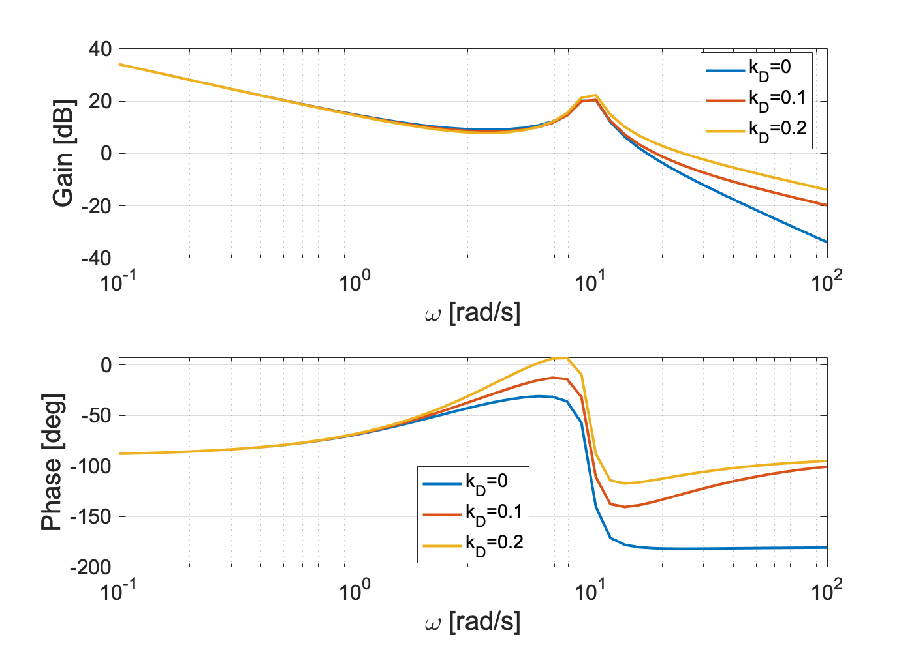

  

```matlab:Code
t = 0:0.01:2;
figure();
for i=1:1:size(kd,2)
    K = tf([kd(i), kp, ki], [1,0]);
    Gyr = feedback(P*K, 1);
    y = step( Gyr, t);
    plot(t,y*ref, 'linewidth', 2, 'DisplayName','k_D='+string(kd(i)))
    hold on;
end
plot_set(gcf, 't', 'y', 'best')
plot(t, ref*ones(1,size(t,2)), 'k');
```


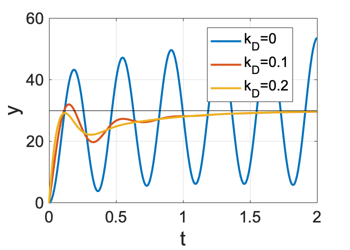

## 開ループ系の比較

```matlab:Code
kp = [2, 1];
ki = [5, 0];
kd = [0.1, 0];
Label = ["After", "Before" ];

figure();
for i=1:1:2
    K = tf([kd(i), kp(i), ki(i)], [1,0]);
    H = P * K;
    [gain, phase, w] = bode(H, logspace(-1,2));
    
    gainLog = 20*log10(gain(:));
    phaseDeg = phase(:);
    
    subplot(2,1,1);
    semilogx(w, gainLog, 'LineWidth', 2, 'DisplayName', Label(i));
    hold on;
    subplot(2,1,2);
    semilogx(w, phaseDeg, 'LineWidth', 2, 'DisplayName',Label(i));
    hold on;
    
    disp(Label(i)); 
    [gm, pm, wpc, wgc] = margin(H)
    disp('----------------');

end
```


```text:Output
After
gm = Inf
pm = 45.2117
wpc = NaN
wgc = 18.8037
----------------
Before
警告: 閉ループ システムは不安定です。
gm = Inf
pm = 12.1170
wpc = Inf
wgc = 13.9959
----------------
```


```matlab:Code
subplot(2,1,1); bodeplot_set(gcf, '\omega [rad/s]', 'Gain [dB]', 'best');
subplot(2,1,2); bodeplot_set(gcf, '\omega [rad/s]', 'Phase [deg]', 'best');
```


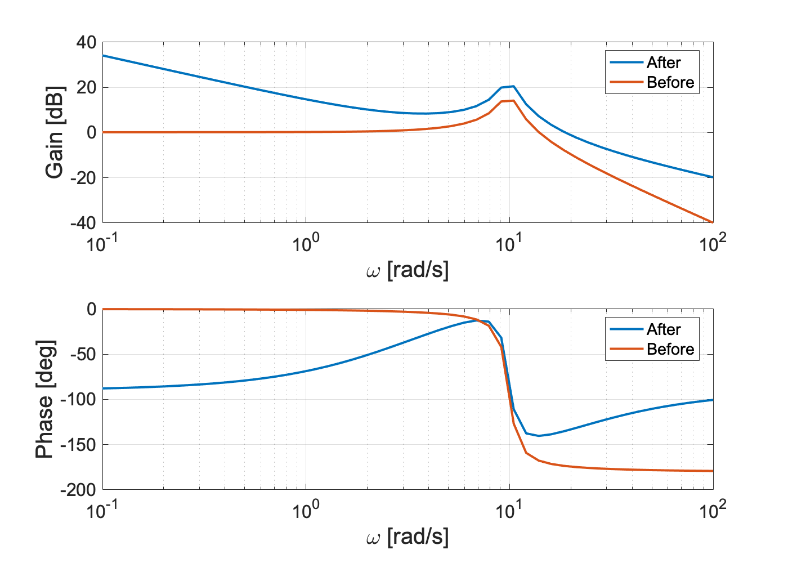

## 閉ループ系の比較

```matlab:Code
t = 0:0.01:2;
figure();
for i=1:1:2
    K = tf([kd(i), kp(i), ki(i)], [1,0]);
    Gyr = feedback(P*K, 1);
    y = step( Gyr, t);
    plot(t,y*ref, 'linewidth', 2, 'DisplayName', Label(i))
    hold on;
    
    disp(Label(i)); 
    ref*(1-dcgain(Gyr))
    disp('----------------');
end
```


```text:Output
After
ans = 0
----------------
Before
ans = 14.8561
----------------
```


```matlab:Code
plot_set(gcf, 't', 'y', 'best')
plot(t, ref*ones(1,size(t,2)), 'k');
```


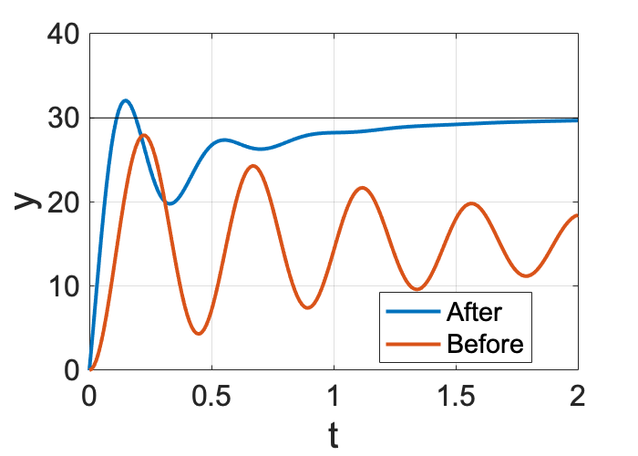

  

```matlab:Code
figure();
for i=1:1:2
    K = tf([kd(i), kp(i), ki(i)], [1,0]);
    Gyr = feedback(P*K, 1);
    [gain, phase, w] = bode(Gyr, logspace(-1,2));
    
    gainLog = 20*log10(gain(:));
    phaseDeg = phase(:);
    
    subplot(2,1,1);
    semilogx(w, gainLog, 'LineWidth', 2, 'DisplayName', Label(i));
    hold on;
    subplot(2,1,2);
    semilogx(w, phaseDeg, 'LineWidth', 2, 'DisplayName',Label(i));
    hold on;
    
    disp(Label(i)); 
    20*log10(dcgain(Gyr))
    disp('----------------');

end
```


```text:Output
After
ans = 0
----------------
Before
ans = -5.9377
----------------
```


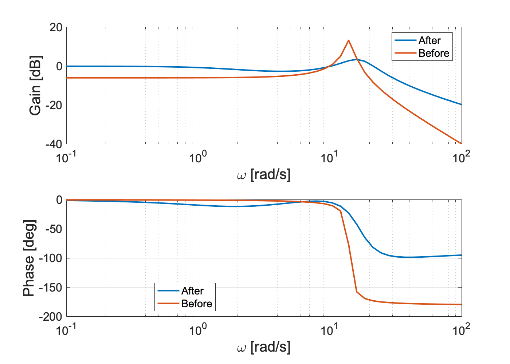


```matlab:Code
subplot(2,1,1); bodeplot_set(gcf, '\omega [rad/s]', 'Gain [dB]', 'best');
subplot(2,1,2); bodeplot_set(gcf, '\omega [rad/s]', 'Phase [deg]', 'best');
```

  
# 位相遅れ・進み補償
## 位相遅れ

```matlab:Code
alpha = 10;
T1 = 0.1;
K1 = tf([alpha*T1, alpha], [alpha*T1, 1]);

figure();

[gain, phase, w] = bode(K1, logspace(-2,3));
gainLog = 20*log10(gain(:));
phaseDeg = phase(:);

subplot(2,1,1);
semilogx(w, gainLog, 'LineWidth', 2);
hold on;
subplot(2,1,2);
semilogx(w, phaseDeg, 'LineWidth', 2);
hold on;

subplot(2,1,1); bodeplot_set(gcf, '\omega [rad/s]', 'Gain [dB]');
subplot(2,1,2); bodeplot_set(gcf, '\omega [rad/s]', 'Phase [deg]');
```


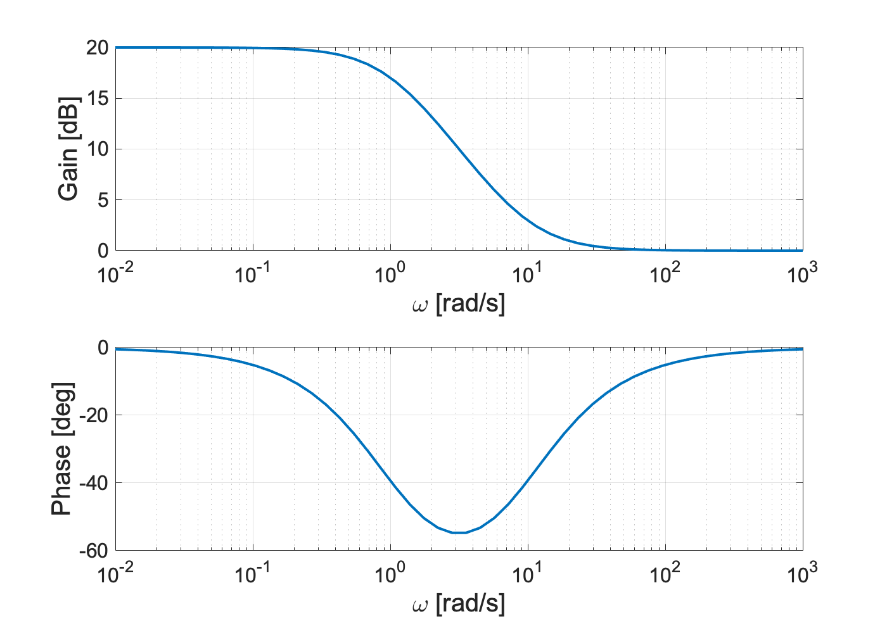


```matlab:Code

omegam = 1/T1/sqrt(alpha)
```


```text:Output
omegam = 3.1623
```


```matlab:Code
phim = asin( (1-alpha)/(1+alpha) ) * 180/pi
```


```text:Output
phim = -54.9032
```

  

```matlab:Code
alpha = 100000;
T1 = 0.1;
K1 = tf([alpha*T1, alpha], [alpha*T1, 1]);

figure();

[gain, phase, w] = bode(K1, logspace(-2,3));
gainLog = 20*log10(gain(:));
phaseDeg = phase(:);

subplot(2,1,1);
semilogx(w, gainLog, 'LineWidth', 2);
hold on;
subplot(2,1,2);
semilogx(w, phaseDeg, 'LineWidth', 2);
hold on;

subplot(2,1,1); bodeplot_set(gcf, '\omega [rad/s]', 'Gain [dB]');
subplot(2,1,2); bodeplot_set(gcf, '\omega [rad/s]', 'Phase [deg]');
```


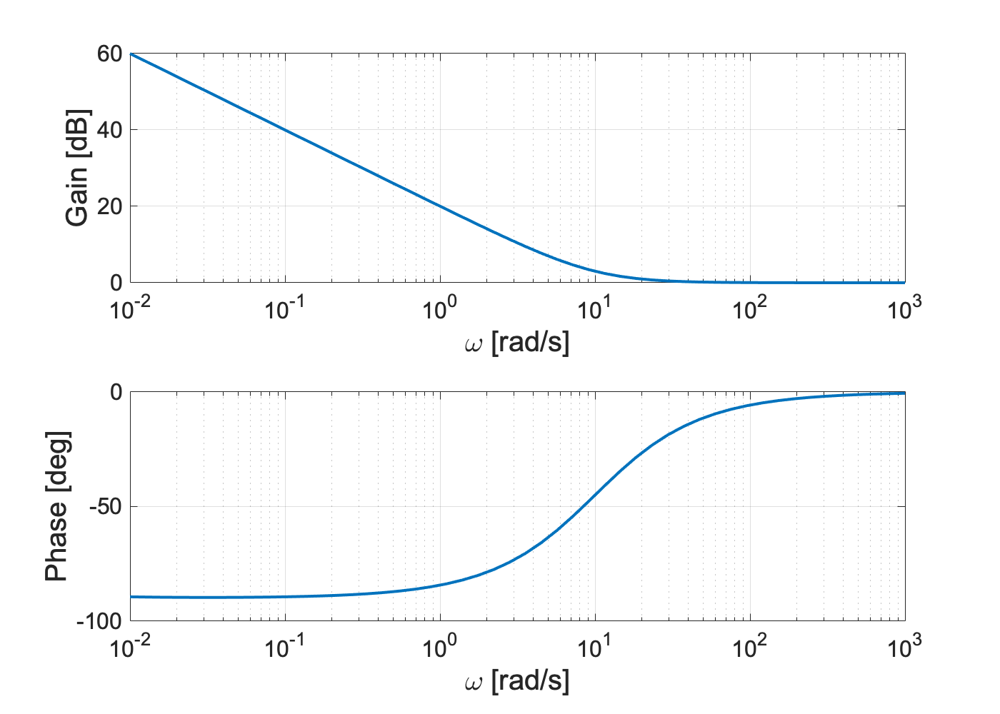


```matlab:Code

omegam = 1/T1/sqrt(alpha)
```


```text:Output
omegam = 0.0316
```


```matlab:Code
phim = asin( (1-alpha)/(1+alpha) ) * 180/pi
```


```text:Output
phim = -89.6376
```

## **位相進み**

```matlab:Code
beta = 0.1;
T2 = 1;
K2 = tf([T2, 1],[beta*T2, 1])
```


```text:Output
K2 =
 
    s + 1
  ---------
  0.1 s + 1
 
連続時間の伝達関数です。
```


```matlab:Code

figure();

[gain, phase, w] = bode(K2, logspace(-2,3));
gainLog = 20*log10(gain(:));
phaseDeg = phase(:);

subplot(2,1,1);
semilogx(w, gainLog, 'LineWidth', 2);
hold on;
subplot(2,1,2);
semilogx(w, phaseDeg, 'LineWidth', 2);
hold on;

subplot(2,1,1); bodeplot_set(gcf, '\omega [rad/s]', 'Gain [dB]');
subplot(2,1,2); bodeplot_set(gcf, '\omega [rad/s]', 'Phase [deg]');
```


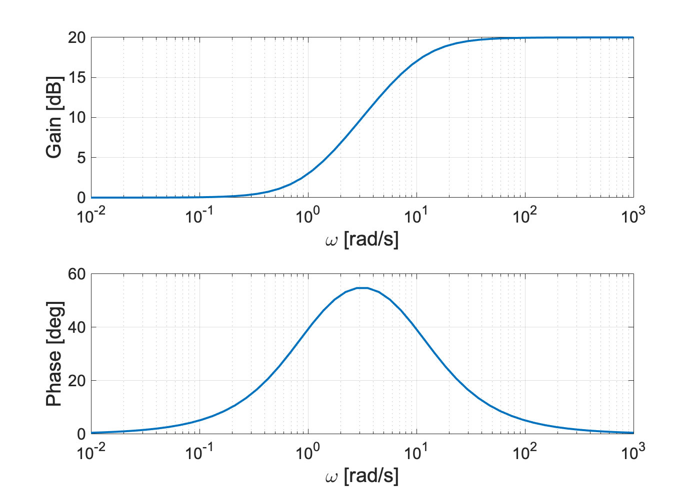


```matlab:Code

omegam = 1/T1/sqrt(alpha)
```


```text:Output
omegam = 0.0316
```


```matlab:Code
phim = asin( (1-alpha)/(1+alpha) ) * 180/pi
```


```text:Output
phim = -89.6376
```

  

```matlab:Code
beta = 0.00001;
T2 = 1;
K2 = tf([T2, 1],[beta*T2, 1])
```


```text:Output
K2 =
 
     s + 1
  -----------
  1e-05 s + 1
 
連続時間の伝達関数です。
```


```matlab:Code

figure();

[gain, phase, w] = bode(K2, logspace(-2,3));
gainLog = 20*log10(gain(:));
phaseDeg = phase(:);

subplot(2,1,1);
semilogx(w, gainLog, 'LineWidth', 2);
hold on;
subplot(2,1,2);
semilogx(w, phaseDeg, 'LineWidth', 2);
hold on;

subplot(2,1,1); bodeplot_set(gcf, '\omega [rad/s]', 'Gain [dB]');
subplot(2,1,2); bodeplot_set(gcf, '\omega [rad/s]', 'Phase [deg]');
```


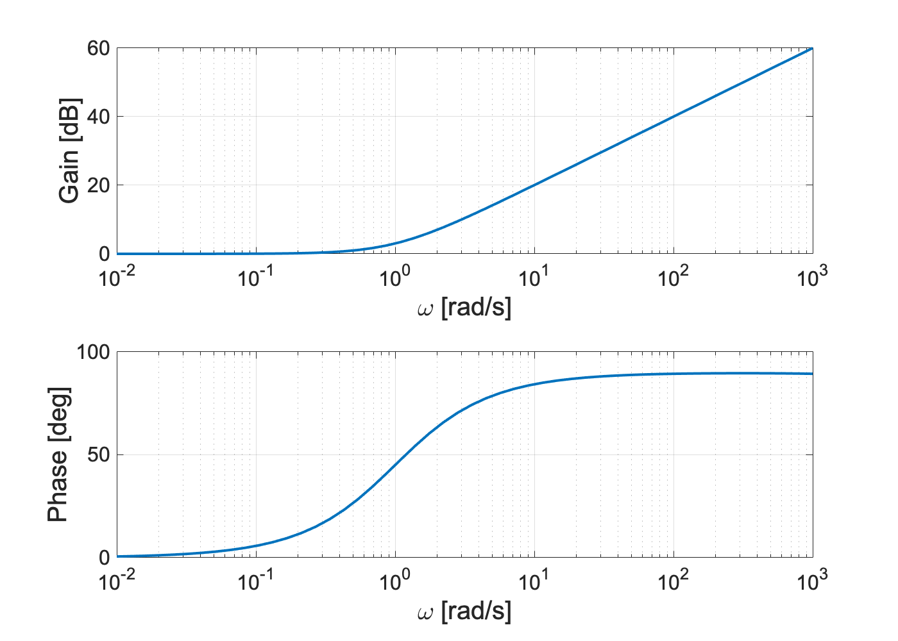


```matlab:Code

omegam = 1/T1/sqrt(alpha)
```


```text:Output
omegam = 0.0316
```


```matlab:Code
phim = asin( (1-alpha)/(1+alpha) ) * 180/pi
```


```text:Output
phim = -89.6376
```

  
# アームの角度制御（位相遅れ・進み補償）

```matlab:Code
g  = 9.81;                % 重力加速度[m/s^2]
l  = 0.2;                 % アームの長さ[m]
M  = 0.5;                 % アームの質量[kg]
mu = 1.5e-2;              % 粘性摩擦係数[kg*m^2/s]
J  = 1.0e-2;              % 慣性モーメント[kg*m^2]

P = tf( [0,1], [J, mu, M*g*l] );

ref = 30; % 目標角度 [deg]
```

  

```matlab:Code
figure();

[gain, phase, w] = bode(P, logspace(-1,2));
gainLog = 20*log10(gain(:));
phaseDeg = phase(:);

subplot(2,1,1);
semilogx(w, gainLog, 'LineWidth', 2);
hold on;
subplot(2,1,2);
semilogx(w, phaseDeg, 'LineWidth', 2);
hold on;

subplot(2,1,1); bodeplot_set(gcf, '\omega [rad/s]', 'Gain [dB]');
subplot(2,1,2); bodeplot_set(gcf, '\omega [rad/s]', 'Phase [deg]');
```


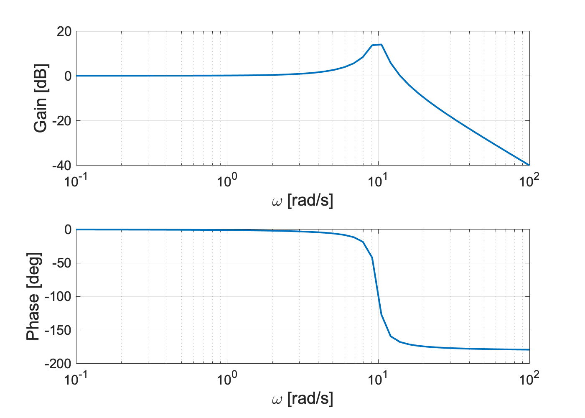


制御対象のボード線図． 低周波ゲインが０[dB]なので，このままフィードバック系を構築しても定常偏差が残る．


## **位相遅れ補償の設計**


**定常偏差を小さくするために，位相遅れ補償から設計する**** **


低周波ゲインを上げるために，α=20とする．そして，ゲインを上げる周波数は，T1で決めるが，最終的なゲイン交差周波数（ゲイン交差周波数の設計値）の１０分の１程度を1/T1にするために，T1=0.25とする（1/T1=40/10=4）．


```matlab:Code
alpha = 20;
T1 = 0.25;
K1 = tf([alpha*T1, alpha], [alpha*T1, 1])
```


```text:Output
K1 =
 
  5 s + 20
  --------
  5 s + 1
 
連続時間の伝達関数です。
```


```matlab:Code

H1 = P*K1;

[gain, phase, w] = bode(H1, logspace(-1,2));
gainLog = 20*log10(gain(:));
phaseDeg = phase(:);

figure();
subplot(2,1,1);
semilogx(w, gainLog, 'LineWidth', 2);
hold on;
subplot(2,1,2);
semilogx(w, phaseDeg, 'LineWidth', 2);
hold on;

subplot(2,1,1); bodeplot_set(gcf, '\omega [rad/s]', 'Gain [dB]');
subplot(2,1,2); bodeplot_set(gcf, '\omega [rad/s]', 'Phase [deg]');
```


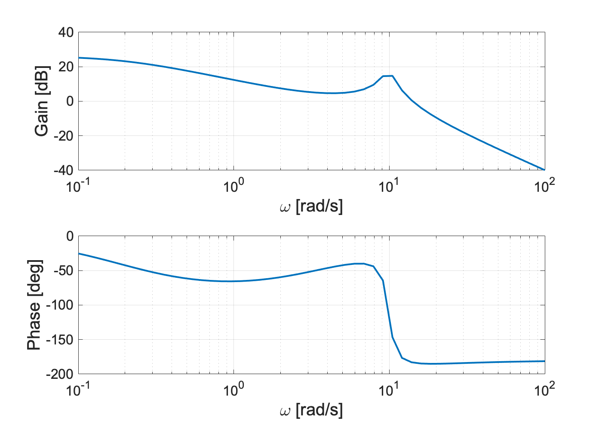


```matlab:Code

S = freqresp(H1, 40);
disp('phase at 40rad/s')
```


```text:Output
phase at 40rad/s
```


```matlab:Code
phaseH1at40 = -(180 + atan(imag(S)/real(S))/pi*180)
```


```text:Output
phaseH1at40 = -176.8636
```


最終的にゲイン補償によって，ゲイン交差周波数を設計値の40[rad/s]まで上げるが，あげてしまうと，位相余裕が60[dB]を下回る．実際， 40[rad/s]における位相は -176[deg]なので，位相余裕は 4[deg]程度になってしまう．したがって，40[rad/s]での位相を -120[deg] まであげておく．


  
## **位相進み補償の設計**


**位相進み補償の設計**** **


40[rad/s]において位相を進ませる量は　60 - (180-176) = 56[deg]程度とする．


```matlab:Code
phim = (60- (180 - phaseH1at40 ) ) * pi/180;
beta = (1-sin(phim))/(1+sin(phim));
T2 = 1/40/sqrt(beta);
K2 = tf([T2, 1],[beta*T2, 1])
```


```text:Output
K2 =
 
   0.1047 s + 1
  --------------
  0.005971 s + 1
 
連続時間の伝達関数です。
```


```matlab:Code

H2 = P*K1*K2;

[gain, phase, w] = bode(H2, logspace(-1,2));
gainLog = 20*log10(gain(:));
phaseDeg = phase(:);

figure();
subplot(2,1,1);
semilogx(w, gainLog, 'LineWidth', 2, 'DisplayName', Label(i));
hold on;
subplot(2,1,2);
semilogx(w, phaseDeg, 'LineWidth', 2, 'DisplayName',Label(i));
hold on;

subplot(2,1,1); bodeplot_set(gcf, '\omega [rad/s]', 'Gain [dB]');
subplot(2,1,2); bodeplot_set(gcf, '\omega [rad/s]', 'Phase [deg]');
```


```matlab:Code

S = freqresp(H2, 40);
disp('mag at 40rad/s')
```


```text:Output
mag at 40rad/s
```


```matlab:Code
magH2at40 = sqrt(imag(S)^2 + real(S)^2)
```


```text:Output
magH2at40 = 0.2800
```


```matlab:Code
disp('phase at 40rad/s')
```


```text:Output
phase at 40rad/s
```


```matlab:Code
phaseH2at40 = -(180 - atan(imag(S)/real(S))/pi*180)
```


```text:Output
phaseH2at40 = -120.0000
```


位相進み補償により，40[rad/s]での位相が -120[deg]となっている． あとは，ゲイン補償により，40[rad/s]のゲインを 0[dB] にすればよい．


## **ゲイン補償の設計**


**ゲイン補償の設計**** **


40[rad/s] におけるゲインが -11[dB] 程度なので， 11[dB]分上に移動させる． そのために，k=1/magH2at40 をゲイン補償とする． これにより，40[rad/s]がゲイン交差周波数になり，位相余裕もPM=60[deg]となる．


```matlab:Code
k = 1/magH2at40
```


```text:Output
k = 3.5719
```


```matlab:Code

H = P*k*K1*K2;
[gm, pm, wpc, wgc] = margin(H)
```


```text:Output
gm = Inf
pm = 60.0000
wpc = Inf
wgc = 40.0000
```


```matlab:Code

[gain, phase, w] = bode(H, logspace(-1,2));
gainLog = 20*log10(gain(:));
phaseDeg = phase(:);

figure();
subplot(2,1,1);
semilogx(w, gainLog, 'LineWidth', 2, 'DisplayName', 'H');
hold on;
subplot(2,1,2);
semilogx(w, phaseDeg, 'LineWidth', 2, 'DisplayName', 'H');
hold on;
```


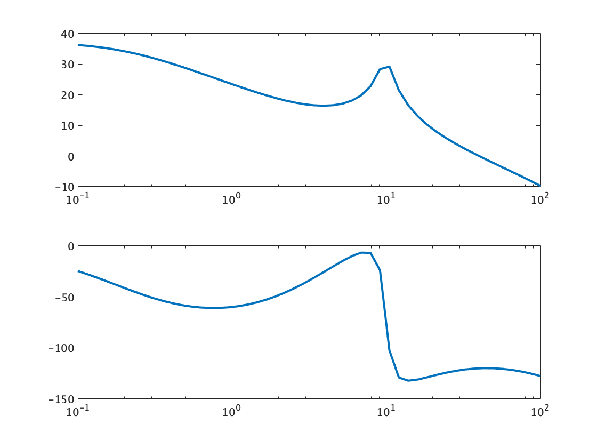


```matlab:Code

[gain, phase, w] = bode(P, logspace(-1,2));
gainLog = 20*log10(gain(:));
phaseDeg = phase(:);

figure();
subplot(2,1,1);
semilogx(w, gainLog, 'LineWidth', 2, 'DisplayName', 'P');
hold on;
subplot(2,1,2);
semilogx(w, phaseDeg, 'LineWidth', 2, 'DisplayName', 'P');
hold on;

subplot(2,1,1); bodeplot_set(gcf, '\omega [rad/s]', 'Gain [dB]', 'Best');
subplot(2,1,2); bodeplot_set(gcf, '\omega [rad/s]', 'Phase [deg]', 'Best');
```


## **閉ループ系の応答**

```matlab:Code
t = 0:0.01:2;

figure();
Gyr_H = feedback(H, 1);
y = step( Gyr_H, t);
plot(t,y*ref, 'linewidth', 2, 'DisplayName', 'After')
hold on;
    
disp('After'); 
```


```text:Output
After
```


```matlab:Code
ref*(1-dcgain(Gyr_H))
```


```text:Output
ans = 0.4064
```


```matlab:Code
disp('----------------');
```


```text:Output
----------------
```


```matlab:Code

Gyr_P = feedback(P, 1);
y = step( Gyr_P, t);
plot(t,y*ref, 'linewidth', 2, 'DisplayName', 'Before')
hold on;
    
disp('Before'); 
```


```text:Output
Before
```


```matlab:Code
ref*(1-dcgain(Gyr_P))
```


```text:Output
ans = 14.8561
```


```matlab:Code
disp('----------------');
```


```text:Output
----------------
```


```matlab:Code

plot_set(gcf, 't', 'y', 'best')
plot(t, ref*ones(1,size(t,2)), 'k');
```


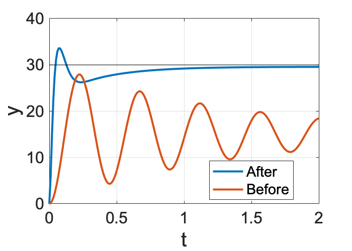

  

```matlab:Code
figure();

[gain, phase, w] = bode(Gyr_H, logspace(-1,2));
gainLog = 20*log10(gain(:));
phaseDeg = phase(:);

subplot(2,1,1);
semilogx(w, gainLog, 'LineWidth', 2, 'DisplayName', 'After');
hold on;
subplot(2,1,2);
semilogx(w, phaseDeg, 'LineWidth', 2, 'DisplayName', 'After');
hold on;

disp('After');
```


```text:Output
After
```


```matlab:Code
20*log10(dcgain(Gyr_H))
```


```text:Output
ans = -0.1185
```


```matlab:Code
disp('----------------');
```


```text:Output
----------------
```


```matlab:Code

[gain, phase, w] = bode(Gyr_P, logspace(-1,2));
gainLog = 20*log10(gain(:));
phaseDeg = phase(:);

subplot(2,1,1);
semilogx(w, gainLog, 'LineWidth', 2, 'DisplayName', 'Before');
hold on;
subplot(2,1,2);
semilogx(w, phaseDeg, 'LineWidth', 2, 'DisplayName', 'Before');
hold on;

disp('Before');
```


```text:Output
Before
```


```matlab:Code
20*log10(dcgain(Gyr_P))
```


```text:Output
ans = -5.9377
```


```matlab:Code
disp('----------------');
```


```text:Output
----------------
```


```matlab:Code

subplot(2,1,1); bodeplot_set(gcf, '\omega [rad/s]', 'Gain [dB]', 'best');
subplot(2,1,2); bodeplot_set(gcf, '\omega [rad/s]', 'Phase [deg]', 'best');
```


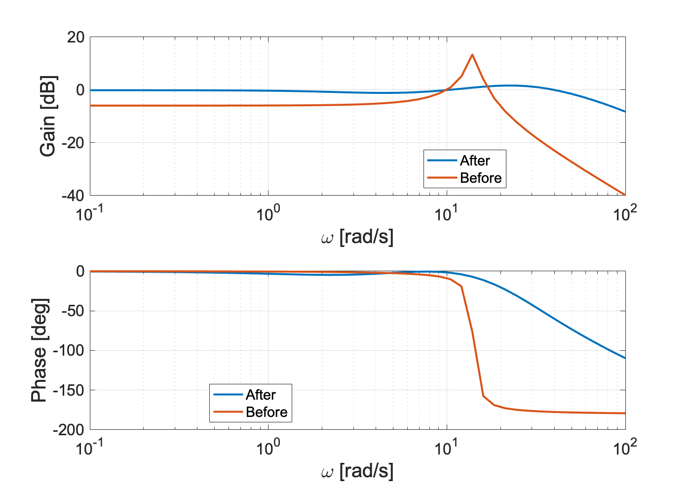

