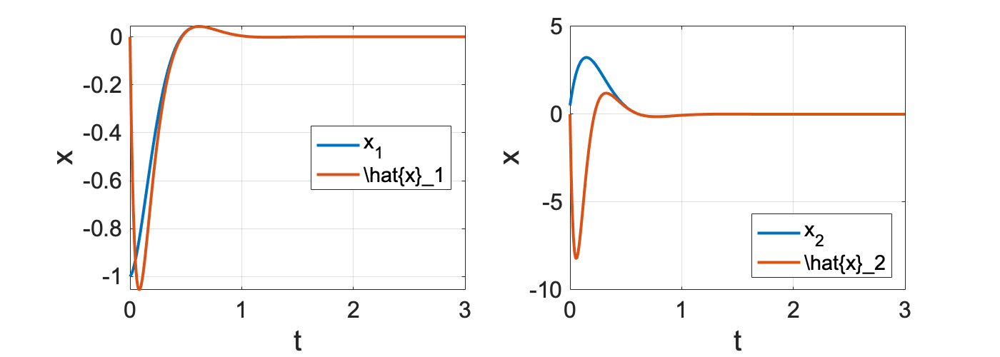

# Chapter7

```matlab:Code
clear
```

# オブザーバ

```matlab:Code
A = [0 1; -4 5];
B = [0; 1];
C = [1 0];
D = 0;
P = ss(A, B, C, D)
```


```text:Output
P =
 
  A = 
       x1  x2
   x1   0   1
   x2  -4   5
 
  B = 
       u1
   x1   0
   x2   1
 
  C = 
       x1  x2
   y1   1   0
 
  D = 
       u1
   y1   0
 
連続時間状態空間モデル。
```


```matlab:Code

A = [0 1; -4 5];
B = [0; 1];
C = [1 0; 0 1];
D = [0; 0];
Ps = ss(A, B, C, D)
```


```text:Output
Ps =
 
  A = 
       x1  x2
   x1   0   1
   x2  -4   5
 
  B = 
       u1
   x1   0
   x2   1
 
  C = 
       x1  x2
   y1   1   0
   y2   0   1
 
  D = 
       u1
   y1   0
   y2   0
 
連続時間状態空間モデル。
```

## **オブザーバゲインの設計（極配置）**

```matlab:Code
% オブザーバ極
observer_poles = [-15+5j,-15-5j];

% オブザーバゲインの設計（状態フィードバックの双対） 
L = -acker(P.A', P.C', observer_poles)'
```


```text:Output
L = 2x1    
   -35
  -421

```


```matlab:Code
eig(P.A + L*P.C)
```


```text:Output
ans = 2x1 complex    
 -15.0000 + 5.0000i
 -15.0000 - 5.0000i

```

  

```matlab:Code
% レギュレータ極
regulator_poles = [-5+5j, -5-5j];
% 極配置
F = -acker(P.A, P.B, regulator_poles)
```


```text:Output
F = 1x2    
   -46   -15

```

  

```matlab:Code
Gsf = ss(P.A + P.B*F, P.B, eye(2), [0 ; 0]);
Obs = ss(P.A + L*P.C, [P.B, -L], eye(2), [0,0; 0,0] );

t = 0:0.01:3;
X0 = [-1, 0.5];
x = initial(Gsf, X0, t);

figure();
subplot(1,2,1);
plot(t, x(:,1), 'linewidth', 2, 'DisplayName','x_1');
hold on;
subplot(1,2,2);
plot(t, x(:,2), 'linewidth', 2, 'DisplayName','x_2');
hold on;

%%%%
% 入力 u = Fx
u = F*x';
% 出力 y = Cx
y = P.C*x';
% オブザーバで推定した状態の振る舞い
xhat = lsim(Obs, [u ; y], t, [0, 0]);
subplot(1,2,1);
plot(t, xhat(:,1), 'linewidth', 2, 'DisplayName','\hat{x}_1');
plot_set(gcf, 't', 'x', 'best')
subplot(1,2,2);
plot(t, xhat(:,2), 'linewidth', 2, 'DisplayName','\hat{x}_2');
plot_set(gcf, 't', 'x', 'best')

set(gcf,'Position',[100 100 700 250])
```




## 出力フィードバック

```matlab:Code
% 出力フィードバック（オブザーバ＋状態フィードバック）
K = ss(P.A+P.B*F+L*P.C, -L, F, 0)
```


```text:Output
K =
 
  A = 
         x1    x2
   x1   -35     1
   x2  -471   -10
 
  B = 
        u1
   x1   35
   x2  421
 
  C = 
        x1   x2
   y1  -46  -15
 
  D = 
       u1
   y1   0
 
連続時間状態空間モデル。
```


```matlab:Code
disp('----------------')
```


```text:Output
----------------
```


```matlab:Code
tf(K)
```


```text:Output
ans =
 
   -7925 s - 9216
  ----------------
  s^2 + 45 s + 821
 
連続時間の伝達関数です。
```


```matlab:Code
% フィードバック系
Gfb = feedback(P, K, 1);
```

  

```matlab:Code
figure();
t = 0:0.01:3;

y = initial(P, [-1, 0.5], t);
plot(t, y, 'linewidth', 2, 'DisplayName', 'w/o controlller');
hold on;

y = initial(Gfb, [-1, 0.5, 0, 0], t);
plot(t, y, 'linewidth', 2, 'DisplayName', 'w/ controller');
hold on;

plot_set(gcf, 't', 'y', 'best')
ylim([-1.5, 3.5])
```


  
# 外乱オブザーバ


出力に0.5の定値外乱が加わるとする


```matlab:Code
t = 0:0.01:3;
X0 = [-1, 0.5];
d = 0.5*(t>0);
x = initial(Gsf, X0, t);

figure();
subplot(1,2,1);
plot(t, x(:,1), 'linewidth', 2, 'DisplayName','x_1');
hold on;
subplot(1,2,2);
plot(t, x(:,2), 'linewidth', 2, 'DisplayName','x_2');
hold on;

%%%%
% 入力 u = Fx
u = F*x';
% 出力 y = Cx + d
y = P.C*x' + d;
% オブザーバで推定した状態の振る舞い
xhat = lsim(Obs, [u ; y], t, [0, 0]);
subplot(1,2,1);
plot(t, xhat(:,1), 'linewidth', 2, 'DisplayName','\hat{x}_1');
plot_set(gcf, 't', 'x', 'best')
subplot(1,2,2);
plot(t, xhat(:,2), 'linewidth', 2, 'DisplayName','\hat{x}_2');
plot_set(gcf, 't', 'x', 'best')

set(gcf,'Position',[100 100 700 250])
```


  

```matlab:Code
% オブザーバ極
observer_poles=[-15+5j,-15-5j, -3] ;

% オブザーバゲインの設計（状態フィードバックの双対）
Abar = [ P.A zeros(2,1); zeros(1,3) ];
Bbar = [ P.B ; 0  ];
Cbar = [ P.C, 1   ];

Lbar = -acker(Abar', Cbar', observer_poles)'
```


```text:Output
Lbar = 3x1    
  149.5000
 -526.0000
 -187.5000

```


```matlab:Code
Fbar = [ F 0 ];

% Obs = ss(Abar+Bbar*Fbar+Lbar*Cbar, -Lbar, np.eye(3), [[0],[0],[0]] )
Aob = Abar + Lbar*Cbar;
Bob = [Bbar -Lbar];
Obs = ss(Aob, Bob, eye(3), zeros(3,2))
```


```text:Output
Obs =
 
  A = 
           x1      x2      x3
   x1   149.5       1   149.5
   x2    -530       5    -526
   x3  -187.5       0  -187.5
 
  B = 
           u1      u2
   x1       0  -149.5
   x2       1     526
   x3       0   187.5
 
  C = 
       x1  x2  x3
   y1   1   0   0
   y2   0   1   0
   y3   0   0   1
 
  D = 
       u1  u2
   y1   0   0
   y2   0   0
   y3   0   0
 
連続時間状態空間モデル。
```

  

```matlab:Code
pole(Obs)
```


```text:Output
ans = 3x1 complex    
 -15.0000 + 5.0000i
 -15.0000 - 5.0000i
  -3.0000 + 0.0000i

```

  

```matlab:Code
t = 0:0.01:3;
X0 = [-1, 0.5];
d = 0.5*(t>0);
x = initial(Gsf, X0, t);

figure();
subplot(1,2,1);
plot(t, x(:,1), 'linewidth', 2, 'DisplayName','x_1');
hold on;
subplot(1,2,2);
plot(t, x(:,2), 'linewidth', 2, 'DisplayName','x_2');
hold on;

%%%%
% 入力 u = Fx
u = F*x';
% 出力 y = Cx + d
y = P.C*x' + d;
% オブザーバで推定した状態の振る舞い
xhat = lsim(Obs, [u ; y], t, [0, 0, 0]);
subplot(1,2,1);
plot(t, xhat(:,1), 'linewidth', 2, 'DisplayName','\hat{x}_1');
plot_set(gcf, 't', 'x', 'best')
subplot(1,2,2);
plot(t, xhat(:,2), 'linewidth', 2, 'DisplayName','\hat{x}_2');
plot_set(gcf, 't', 'x', 'best')

set(gcf,'Position',[100 100 700 250])
```


# ロバスト制御

```matlab:Code
g  = 9.81;                % 重力加速度[m/s^2]
l  = 0.2;                 % アームの長さ[m]
M  = 0.5;                 % アームの質量[kg]
mu = 1.5e-2;              % 粘性摩擦係数[kg*m^2/s]
J  = 1.0e-2;              % 慣性モーメント[kg*m^2]

P = tf( [0,1], [J, mu, M*g*l] );

ref = 30; % 目標角度 [deg]
```

## **乗法的不確かさ**

```matlab:Code
% 垂直駆動アームのノミナルモデル
Pn = tf( [0,1], [J, mu, M*g*l] );

% 不確かさ
delta = -1:0.1:1;
WT = tf( [10, 0], [1, 150]);

figure();
for i=1:1:size(delta,2)
    % 不確かさをもつ制御対象
    P = (1 + WT*delta(i))*Pn;
    [gain, ~, w] = bode(P, logspace(-3,3));
    subplot(1,2,1);
    semilogx(w, 20*log10(gain(:)), 'k', 'LineWidth', 1);
    hold on; grid on;
    
    % 乗法的不確かさ
    DT = (P - Pn)/Pn;
    [gain, ~, w] = bode(DT, logspace(-3,3));
    subplot(1,2,2);
    semilogx(w, 20*log10(gain(:)), 'k', 'LineWidth', 1);
    hold on; grid on;
end
set(gcf,'Position',[100 100 700 250])
```


## 混合感度問題

```matlab:Code
WS = tf( [0, 1], [1, 1, 0.25]); % 感度関数に対する重み関数 
WU = tf(1, 1);
WT = tf( [10, 0], [1, 150]); % 相補感度関数に対する重み関数

% 混合感度問題
[K, ~, gamma] = mixsyn(Pn, WS, WU, WT);

tf(K)
```


```text:Output
ans =
 
     3.54 s^4 + 539.7 s^3 + 1642 s^2 + 5.316e04 s + 4.843e04
  -------------------------------------------------------------
  s^5 + 161.3 s^4 + 1850 s^3 + 2.013e04 s^2 + 1.882e04 s + 4600
 
連続時間の伝達関数です。
```


```matlab:Code
gamma
```


```text:Output
gamma = 0.9600
```


```matlab:Code

L = Pn*K;
I = eye(size(L));
S = feedback(I, L);
T = I-S;

figure();
sigma(S, WS, T, WT, {0.1,10000})
legend('S', 'WS', 'T','WT')
```


  

```matlab:Code
figure();
% 感度関数
Ssys = feedback(1, Pn*K);
[gain, ~, w] = bode(Ssys, logspace(-3,3));
subplot(1,2,1);
semilogx(w, 20*log10(gain(:)), 'LineWidth', 2);
hold on; grid on;

[gain, ~, w] = bode(1/WS, logspace(-3,3));
subplot(1,2,1);
semilogx(w, 20*log10(gain(:)), 'LineWidth', 2);

% 相補感度関数
Tsys = feedback(Pn*K, 1);
[gain, ~, w] = bode(Tsys, logspace(-3,3));
subplot(1,2,2);
semilogx(w, 20*log10(gain(:)), 'LineWidth', 2);
hold on; grid on;

[gain, ~, w] = bode(1/WT, logspace(-3,3));
subplot(1,2,2);
semilogx(w, 20*log10(gain(:)), 'LineWidth', 2);
set(gcf,'Position',[100 100 700 250])
```


```matlab:Code
figure();
t = 0:0.01:2;
for i = 1:1:size(delta,2)
    P = (1 + WT*delta(i))*Pn;
    Gyr = feedback(P*K, 1);
   
    y = step(Gyr, t);
    plot(t,y*ref, 'k', 'linewidth', 1)
    hold on;
end

Gyr = feedback(Pn*K, 1);
y = step(Gyr, t);
plot(t,y*ref, 'linewidth', 2)

plot_set(gcf, 't', 'y')
```


ナイキスト軌跡


```matlab:Code
figure();

for i = 1:1:size(delta,2)
    P = (1 + WT*delta(i))*Pn;
   
    [x, y] = nyquist(P*K, logspace(-3,5,1000));
    plot(x(:), y(:), 'k', 'LineWidth', 1);
    hold on;
end
[x, y] = nyquist(Pn*K, logspace(-3,5,1000));
plot(x(:), y(:), 'LineWidth', 2);
scatter(-1, 0, 'filled', 'k');
plot_set(gcf, '', '')
xlim(gca, [-1.2, 1.2])
ylim(gca, [-1.2, 1.2])
axis square
```


## PID制御との比較

```matlab:Code
figure();
t = 0:0.01:2;
kp = 2;
kd = 0.1;
ki = 10;
Kpid = tf([kd, kp, ki], [1, 0]);

for i = 1:1:size(delta,2)
    P = (1 + WT*delta(i))*Pn;
    Gyr = feedback(P*Kpid, 1);
   
    y = step(Gyr, t);
    plot(t,y*ref, 'k', 'linewidth', 1)
    hold on;
end

Gyr = feedback(Pn*K, 1);
y = step(Gyr, t);
plot(t,y*ref, 'linewidth', 2)

plot_set(gcf, 't', 'y')
ylim([-10, 60])
```


ナイキスト軌跡


```matlab:Code
figure();

for i = 1:1:size(delta,2)
    P = (1 + WT*delta(i))*Pn;
   
    [x, y] = nyquist(P*Kpid, logspace(-3,5,1000));
    plot(x(:), y(:), 'k', 'LineWidth', 1);
    hold on;
end
[x, y] = nyquist(Pn*Kpid, logspace(-3,5,1000));
plot(x(:), y(:), 'LineWidth', 2);
scatter(-1, 0, 'filled', 'k');
plot_set(gcf, '', '')
xlim(gca, [-1.2, 1.2])
ylim(gca, [-1.2, 1.2])
axis square
```


# ディジタル実装

```matlab:Code
P = tf([0, 1], [0.5, 1])
```


```text:Output
P =
 
      1
  ---------
  0.5 s + 1
 
連続時間の伝達関数です。
```

  

```matlab:Code
ts = 0.2;

Pd1 = c2d(P, ts, 'zoh')
```


```text:Output
Pd1 =
 
    0.3297
  ----------
  z - 0.6703
 
サンプル時間:  0.2 seconds
離散時間の伝達関数です。
```


```matlab:Code
Pd2 = c2d(P, ts, 'tustin')
```


```text:Output
Pd2 =
 
  0.1667 z + 0.1667
  -----------------
     z - 0.6667
 
サンプル時間:  0.2 seconds
離散時間の伝達関数です。
```

  

```matlab:Code
figure();

t = 0:0.01:3;
y = step(P, t);
subplot(1,2,1);
plot(t, y, 'linewidth', 2, 'DisplayName', 'continuous');
hold on; grid on;
subplot(1,2,2);
plot(t, y, 'linewidth', 2, 'DisplayName', 'continuous');
hold on; grid on;

td = 0:ts:3;
y = step(Pd1, td);
subplot(1,2,1);
scatter(td, y, 'filled', 'DisplayName','zoh');
plot_set(gcf, 't', 'y', 'best')

y = step(Pd2, td);
subplot(1,2,2);
scatter(td, y, 'filled', 'DisplayName','tustin');
plot_set(gcf, 't', 'y', 'best')

set(gcf,'Position',[100 100 700 300])
```


```matlab:Code
figure();

t = 0:0.01:3;
Uc = 0.5*sin(6*t) + 0.5*cos(8*t);

y = lsim(P, Uc, t);
subplot(1,2,1);
plot(t, y, 'linewidth', 2, 'DisplayName', 'continuous');
hold on; grid on;
subplot(1,2,2);
plot(t, y, 'linewidth', 2, 'DisplayName', 'continuous');
hold on; grid on;

td = 0:ts:3;
Ud = 0.5*sin(6*td) + 0.5*cos(8*td);
y = lsim(Pd1, Ud, td);
subplot(1,2,1);
scatter(td, y, 'filled', 'DisplayName','zoh');
plot_set(gcf, 't', 'y', 'best')

y = lsim(Pd2, Ud, td);
subplot(1,2,2);
scatter(td, y, 'filled', 'DisplayName','tustin');
plot_set(gcf, 't', 'y', 'best')

set(gcf,'Position',[100 100 700 300])
```


  

```matlab:Code
figure();

[gain, phase, w] = bode(P, logspace(-2,2));
gainLog = 20*log10(gain(:));
phaseDeg = phase(:);

subplot(2,1,1);
semilogx(w, gainLog, 'LineWidth', 2, 'DisplayName', 'continuous');
hold on;
subplot(2,1,2);
semilogx(w, phaseDeg, 'LineWidth', 2, 'DisplayName','continuous');
hold on;

[gain, phase, w] = bode(Pd1, logspace(-2,2));
gainLog = 20*log10(gain(:));
phaseDeg = phase(:);

subplot(2,1,1);
semilogx(w, gainLog, 'LineWidth', 2, 'DisplayName', 'zoh');
hold on;
subplot(2,1,2);
semilogx(w, phaseDeg, 'LineWidth', 2, 'DisplayName','zoh');
hold on;

[gain, phase, w] = bode(Pd2, logspace(-2,2));
gainLog = 20*log10(gain(:));
phaseDeg = phase(:);

subplot(2,1,1);
semilogx(w, gainLog, 'LineWidth', 2, 'DisplayName', 'tustin');
hold on; grid on; legend('Location','best');
xlim([0.01, pi/ts])
subplot(2,1,2);
semilogx(w, phaseDeg, 'LineWidth', 2, 'DisplayName','tustin');
hold on; grid on; legend('Location','best');
xlim([0.01, pi/ts])
```


```matlab:Code
ts = 0.5;
Pd1 = c2d(P, ts, 'zoh')
```


```text:Output
Pd1 =
 
    0.6321
  ----------
  z - 0.3679
 
サンプル時間:  0.5 seconds
離散時間の伝達関数です。
```


```matlab:Code
Pd2 = c2d(P, ts, 'tustin')
```


```text:Output
Pd2 =
 
  0.3333 z + 0.3333
  -----------------
     z - 0.3333
 
サンプル時間:  0.5 seconds
離散時間の伝達関数です。
```


```matlab:Code

figure();

[gain, phase, w] = bode(P, logspace(-2,2));
gainLog = 20*log10(gain(:));
phaseDeg = phase(:);

subplot(2,1,1);
semilogx(w, gainLog, 'LineWidth', 2, 'DisplayName', 'continuous');
hold on;
subplot(2,1,2);
semilogx(w, phaseDeg, 'LineWidth', 2, 'DisplayName','continuous');
hold on;

[gain, phase, w] = bode(Pd1, logspace(-2,2));
gainLog = 20*log10(gain(:));
phaseDeg = phase(:);

subplot(2,1,1);
semilogx(w, gainLog, 'LineWidth', 2, 'DisplayName', 'zoh');
hold on;
subplot(2,1,2);
semilogx(w, phaseDeg, 'LineWidth', 2, 'DisplayName','zoh');
hold on;

[gain, phase, w] = bode(Pd2, logspace(-2,2));
gainLog = 20*log10(gain(:));
phaseDeg = phase(:);

subplot(2,1,1);
semilogx(w, gainLog, 'LineWidth', 2, 'DisplayName', 'tustin');
hold on; grid on; legend('Location','best');
xlim([0.01, pi/ts])
subplot(2,1,2);
semilogx(w, phaseDeg, 'LineWidth', 2, 'DisplayName','tustin');
hold on; grid on; legend('Location','best');
xlim([0.01, pi/ts])
```


